# Projet 2 — Poste multi-utilisateurs pour salle informatique

> **Jean-Pierre Gallego Santillan** · IT Essentials ICT-187 · Classe E1A · Septembre 2026

## Sommaire

- [1. Présentation du projet](#1-présentation-du-projet)
  - [1.1 Objectifs](#11-objectifs)
  - [1.2 Environnement de travail](#12-environnement-de-travail)
  - [1.3 Comptes mis en place](#13-comptes-mis-en-place)
- [2. Création de la machine virtuelle et installation de Windows 10 Pro](#2-création-de-la-machine-virtuelle-et-installation-de-windows-10-pro)
  - [2.1 Création de la machine virtuelle](#21-création-de-la-machine-virtuelle)
  - [2.2 Dimensionnement du disque](#22-dimensionnement-du-disque)
  - [2.3 Récapitulatif du matériel virtuel](#23-récapitulatif-du-matériel-virtuel)
  - [2.4 Installation du système](#24-installation-du-système)
- [3. Création des trois comptes utilisateurs standards](#3-création-des-trois-comptes-utilisateurs-standards)
  - [3.1 Accès au panneau des comptes](#31-accès-au-panneau-des-comptes)
  - [3.2 Saisie des informations du compte](#32-saisie-des-informations-du-compte)
- [4. Sécurisation du compte administrateur existant](#4-sécurisation-du-compte-administrateur-existant)
- [5. Création du compte administrateur dédié à la maintenance](#5-création-du-compte-administrateur-dédié-à-la-maintenance)
  - [5.1 La commande utilisée](#51-la-commande-utilisée)
  - [5.2 Ajout au groupe Administrateurs et vérification](#52-ajout-au-groupe-administrateurs-et-vérification)
- [6. Mise à jour du système](#6-mise-à-jour-du-système)
- [7. Cloisonnement des dossiers personnels (permissions NTFS)](#7-cloisonnement-des-dossiers-personnels-permissions-ntfs)
  - [7.1 Vérification des profils utilisateurs](#71-vérification-des-profils-utilisateurs)
  - [7.2 Application des droits NTFS](#72-application-des-droits-ntfs)
  - [7.3 Vérification des droits appliqués](#73-vérification-des-droits-appliqués)
  - [7.4 Premier test d'accès](#74-premier-test-daccès)
- [8. Verrouillage automatique de la session après inactivité](#8-verrouillage-automatique-de-la-session-après-inactivité)
  - [8.1 Ouverture de la stratégie de sécurité locale](#81-ouverture-de-la-stratégie-de-sécurité-locale)
  - [8.2 Recherche du paramètre](#82-recherche-du-paramètre)
  - [8.3 Configuration du délai](#83-configuration-du-délai)
- [9. Politique de mots de passe](#9-politique-de-mots-de-passe)
- [10. Politique de verrouillage de compte](#10-politique-de-verrouillage-de-compte)
- [11. Tests croisés de cloisonnement](#11-tests-croisés-de-cloisonnement)
  - [11.1 Récapitulatif des tests](#111-récapitulatif-des-tests)
- [12. Conclusion](#12-conclusion)
- [Annexe A — Identifiants de la machine virtuelle de démonstration](#annexe-a--identifiants-de-la-machine-virtuelle-de-démonstration)
- [Annexe B — Récapitulatif des commandes utilisées](#annexe-b--récapitulatif-des-commandes-utilisées)

---

## 1. Présentation du projet

Ce projet consiste à préparer un poste de travail Windows 10 Pro destiné à une salle informatique partagée par plusieurs élèves. L'objectif est qu'un même ordinateur puisse être utilisé par plusieurs personnes sans qu'aucune d'entre elles ne puisse consulter, modifier ou supprimer les fichiers personnels d'une autre.

Le poste a été monté dans une machine virtuelle afin de pouvoir tester la configuration sans risque et de la réinitialiser en cas d'erreur.

### 1.1 Objectifs

- Créer au moins trois comptes utilisateurs standards distincts.
- Créer un compte administrateur dédié à la maintenance, non utilisé au quotidien.
- Configurer des dossiers personnels protégés par des droits NTFS, de sorte qu'un utilisateur ne puisse pas consulter les fichiers d'un autre.
- Mettre en place un verrouillage automatique de la session après une période d'inactivité.
- Mettre en place une politique de mots de passe et une politique de verrouillage de compte.
- Tester le cloisonnement en se connectant successivement avec chaque compte.

### 1.2 Environnement de travail

| Élément | Valeur |
| --- | --- |
| Hyperviseur | VMware Workstation Pro 17 |
| Nom de la machine virtuelle | VM_Etudiant_PPE |
| Système installé | Windows 10 Pro 64 bits (image ISO) |
| Disque virtuel | 75 Go (au lieu des 60 Go recommandés) |
| Mémoire vive | 8192 Mo |
| Processeur | 2 cœurs |
| Carte réseau | NAT |
| Comptes créés | 3 comptes élèves + 1 compte de maintenance |

### 1.3 Comptes mis en place

| Compte | Type | Rôle |
| --- | --- | --- |
| David Rey | Utilisateur standard | Élève |
| Abi Kanthavel | Utilisateur standard | Élève |
| Ardit Katana | Utilisateur standard | Élève |
| adm-maintenance | Administrateur | Maintenance du poste uniquement |
| J-P-G | Administrateur | Compte créé à l'installation de Windows |

Les identifiants utilisés pour la démonstration sont regroupés en [annexe A](#Annexe-A--Identifiants-de-la-machine-virtuelle-de-démonstration).

---

## 2. Création de la machine virtuelle et installation de Windows 10 Pro

### 2.1 Création de la machine virtuelle

L'assistant de création de VMware Workstation Pro 17 est lancé en mode *Typical*, qui suffit pour une installation standard de Windows 10.

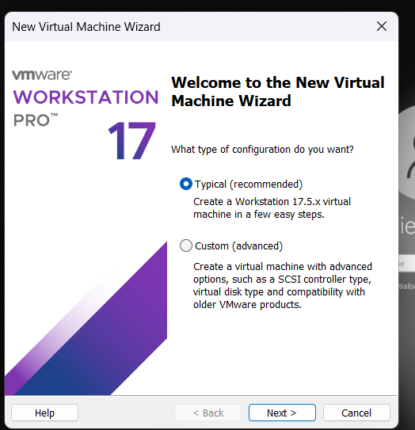
*Figure 1 — Lancement de l'assistant « New Virtual Machine Wizard ».*

L'image ISO d'installation de Windows 10 Pro est ensuite sélectionnée comme support d'installation.

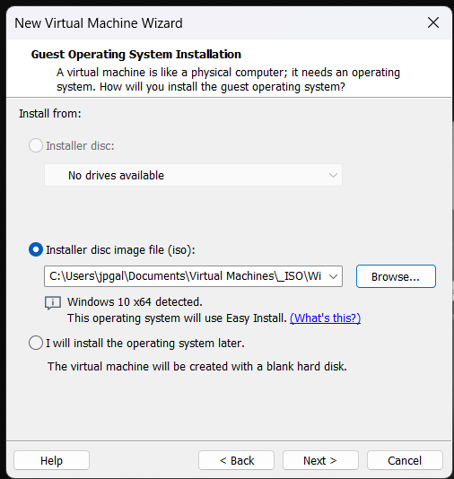
*Figure 2 — Sélection de l'ISO de Windows 10 Pro.*

La machine virtuelle reçoit un nom explicite, `VM_Etudiant_PPE`, ainsi qu'un emplacement de stockage sur le disque.

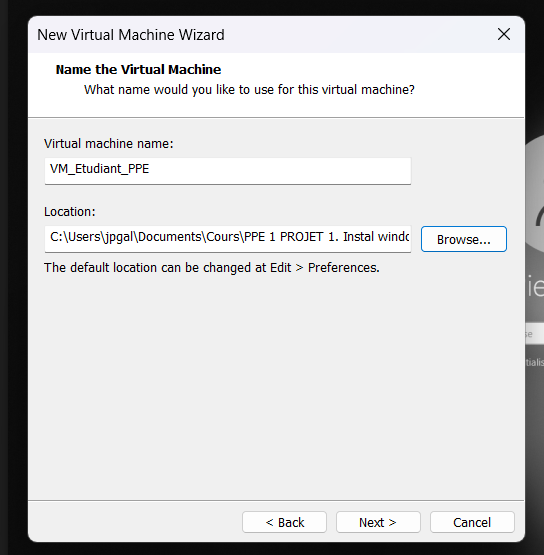
*Figure 3 — Nom et emplacement de la machine virtuelle.*

### 2.2 Dimensionnement du disque

VMware recommande 60 Go pour Windows 10. J'ai volontairement porté le disque à **75 Go** afin de garder de la marge pour les mises à jour et les applications qui seront installées ensuite. Le disque est créé en plusieurs fichiers (*split*), ce qui facilite la copie de la machine virtuelle d'un support à un autre.

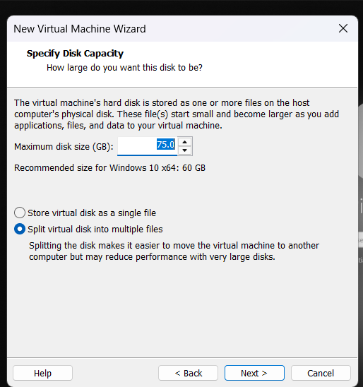
*Figure 4 — Disque virtuel porté de 60 Go à 75 Go.*

### 2.3 Récapitulatif du matériel virtuel

Avant de valider, l'assistant affiche le récapitulatif de la configuration matérielle : 8192 Mo de mémoire vive, 2 cœurs de processeur, un disque de 75 Go et une carte réseau en mode NAT. Cette configuration est suffisante pour faire tourner Windows 10 avec plusieurs sessions utilisateurs ouvertes.

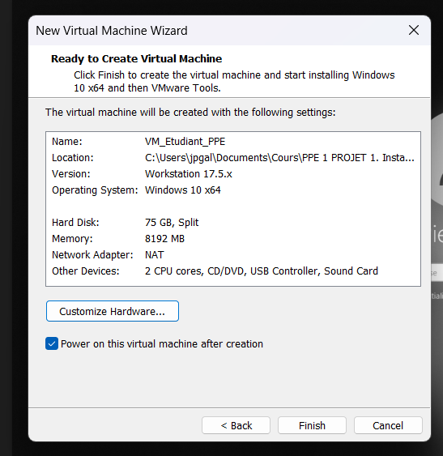
*Figure 5 — Récapitulatif avant création : mémoire, processeur, disque et réseau.*

### 2.4 Installation du système

Le bouton *Finish* crée la machine et la démarre sur l'ISO : l'installation de Windows se déroule alors normalement (copie des fichiers, installation des fonctionnalités et des mises à jour).

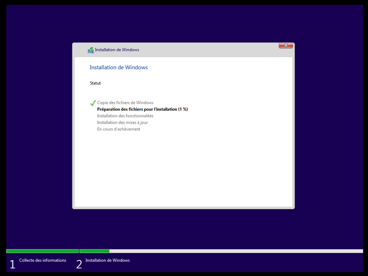
*Figure 6 — Installation de Windows 10 Pro en cours.*

---

## 3. Création des trois comptes utilisateurs standards

### 3.1 Accès au panneau des comptes

La création des comptes se fait depuis **Paramètres → Comptes**.

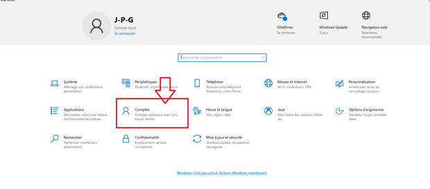
*Figure 7 — Ouverture de la rubrique « Comptes » dans les Paramètres.*

Dans le menu de gauche, je sélectionne **Famille et autres utilisateurs**.

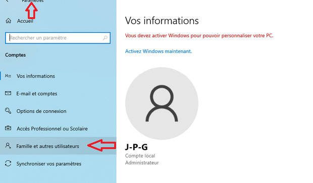
*Figure 8 — Rubrique « Famille et autres utilisateurs ».*

Puis je clique sur **Ajouter un autre utilisateur sur ce PC**.

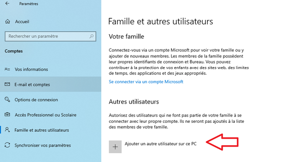
*Figure 9 — Bouton « Ajouter un autre utilisateur sur ce PC ».*

Windows propose par défaut de relier le compte à un compte Microsoft. Comme les postes de la salle doivent fonctionner sans connexion à un compte en ligne, je choisis l'option **Je ne dispose pas des informations de connexion de cette personne**, puis **Ajouter un utilisateur sans compte Microsoft**. Cela crée un compte purement local.

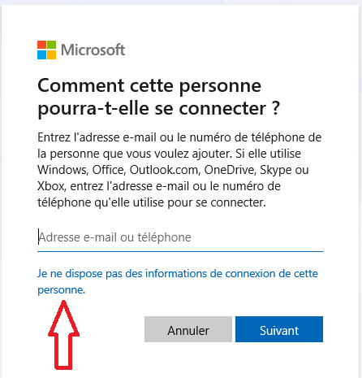
*Figure 10 — Choix de l'option permettant de créer un compte local.*

### 3.2 Saisie des informations du compte

La fenêtre de création demande trois éléments : le nom de la personne qui utilisera le poste, son mot de passe (saisi deux fois) et des questions de sécurité servant à récupérer l'accès en cas d'oubli. Le premier compte créé est celui de **David Rey**.

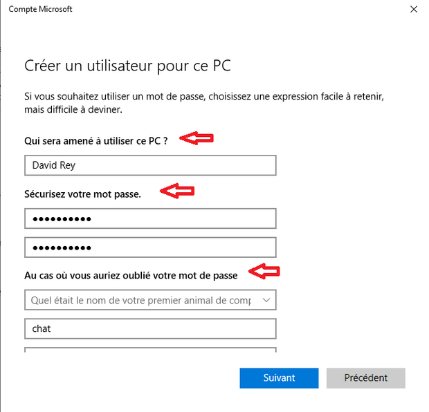
*Figure 11 — Création du compte « David Rey » : nom, mot de passe et questions de sécurité.*

L'opération est répétée à l'identique pour les deux autres élèves.

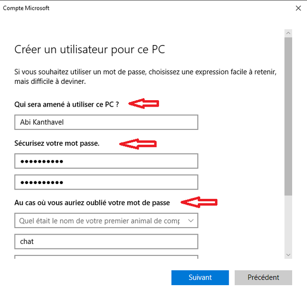
*Figure 12 — Création du deuxième compte élève.*

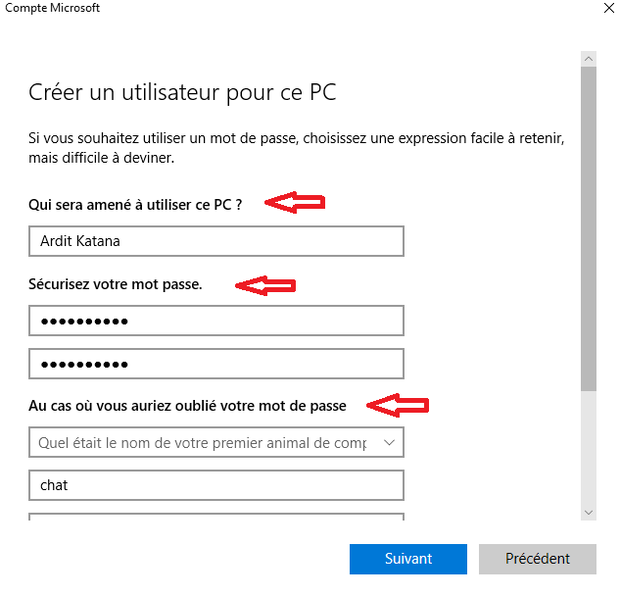
*Figure 13 — Création du troisième compte élève.*

Les trois comptes sont créés en tant qu'**utilisateurs standards**, c'est-à-dire sans droits d'administration : un élève ne peut donc ni installer de logiciel, ni modifier les paramètres système du poste.

---

## 4. Sécurisation du compte administrateur existant

Le compte `J-P-G`, créé lors de l'installation de Windows, ne possédait pas encore de mot de passe. Je lui en attribue un via PowerShell ouvert en tant qu'administrateur.

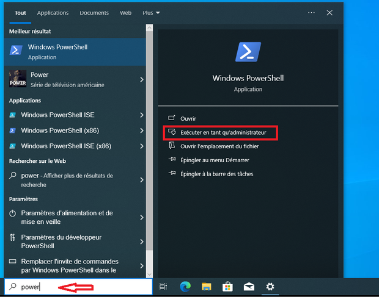
*Figure 14 — Ouverture de PowerShell en mode administrateur depuis la barre de recherche.*

```powershell
Net User J-P-G <mot_de_passe>
```

La commande `Net User` suivie du nom du compte et d'un mot de passe modifie directement le mot de passe du compte local. Le message « La commande s'est terminée correctement » confirme l'opération.

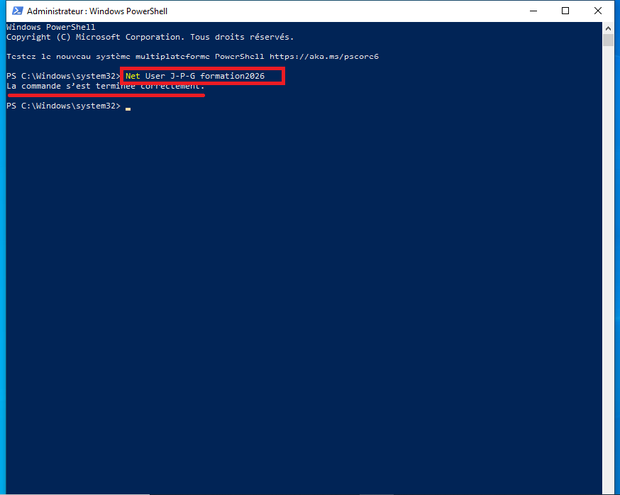
*Figure 15 — Attribution d'un mot de passe au compte administrateur J-P-G.*

> [!WARNING]
> **Remarque de sécurité.** Sur la capture, le mot de passe apparaît en clair dans la ligne de commande. C'est acceptable sur une machine virtuelle de formation, mais à éviter en production : le mot de passe reste visible à l'écran et il est enregistré dans l'historique de la console. La méthode utilisée au point suivant (`Read-Host -AsSecureString`) est la bonne pratique.

---

## 5. Création du compte administrateur dédié à la maintenance

Un compte administrateur séparé est créé pour toutes les opérations de maintenance. Il ne sert jamais à l'usage quotidien : si un élève ou un enseignant travaille avec une session standard, un logiciel malveillant lancé par erreur n'hérite pas des droits d'administration.

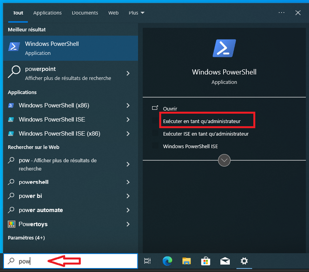
*Figure 16 — Réouverture de PowerShell en mode administrateur.*

### 5.1 La commande utilisée

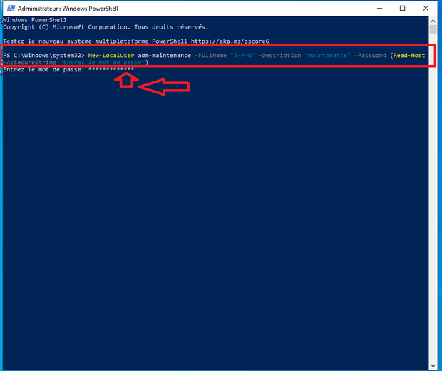
*Figure 17 — Création du compte adm-maintenance avec New-LocalUser.*

```powershell
New-LocalUser adm-maintenance -FullName "J-P-G" -Description "maintenance" -Password (Read-Host -AsSecureString "Entrez le mot de passe")
```

Détail de la commande :

| Élément | Rôle |
| --- | --- |
| `New-LocalUser` | Applet de commande PowerShell qui crée un compte **local** sur la machine (pas un compte Microsoft ni un compte de domaine). |
| `adm-maintenance` | Nom de connexion du compte. Le préfixe `adm-` permet de repérer immédiatement qu'il s'agit d'un compte d'administration. |
| `-FullName "J-P-G"` | Nom complet affiché sur l'écran de connexion et dans la gestion des utilisateurs. |
| `-Description "maintenance"` | Commentaire qui rappelle la fonction du compte à toute personne qui reprendrait le poste. |
| `-Password (...)` | Mot de passe du compte. Il doit être fourni sous forme de chaîne sécurisée (*SecureString*). |
| `Read-Host -AsSecureString` | Demande le mot de passe de façon interactive et le masque à l'écran (les caractères s'affichent en astérisques). Le mot de passe n'apparaît donc ni dans la console, ni dans l'historique des commandes. |

Après validation, PowerShell affiche la fiche du compte nouvellement créé, ce qui confirme que la commande a abouti.

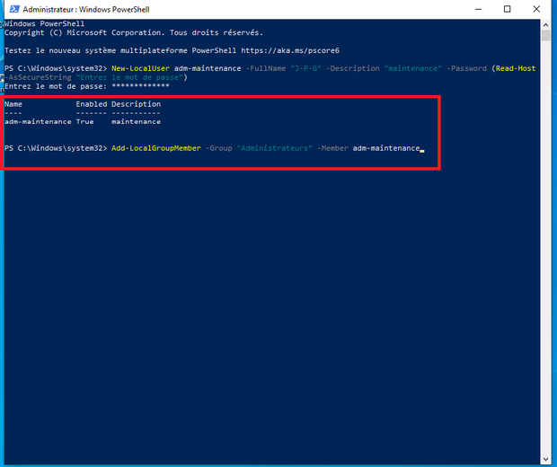
*Figure 18 — Confirmation de la création du compte adm-maintenance.*

### 5.2 Ajout au groupe Administrateurs et vérification

Le compte est ensuite ajouté au groupe local **Administrateurs**, puis la composition du groupe est vérifiée :

```powershell
Add-LocalGroupMember -Group "Administrateurs" -Member adm-maintenance
Get-LocalGroupMember -Group "Administrateurs"
```

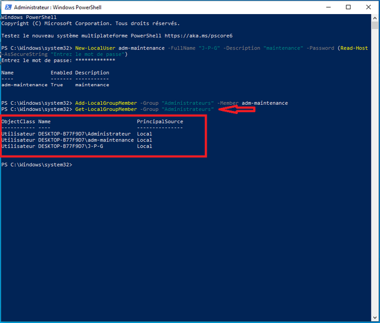
*Figure 19 — Vérification des membres du groupe « Administrateurs ».*

Le résultat affiche trois membres :

- **Administrateur** — le compte administrateur intégré de Windows, désactivé par défaut ;
- **adm-maintenance** — le nouveau compte de maintenance, correctement ajouté ;
- **J-P-G** — le compte administrateur créé lors de l'installation.

Aucun des trois comptes élèves n'apparaît dans ce groupe : ils sont donc bien restés des utilisateurs standards, ce qui est l'objectif recherché.

---

## 6. Mise à jour du système

Avant de configurer la sécurité, le système est entièrement mis à jour via **Windows Update**. Un poste à jour bénéficie des derniers correctifs de sécurité, ce qui fait partie intégrante de la mise en service d'un poste de travail.

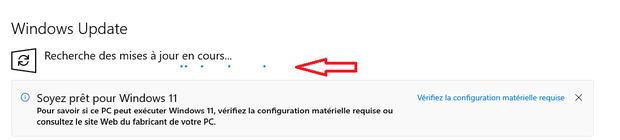
*Figure 20 — Recherche des mises à jour disponibles.*

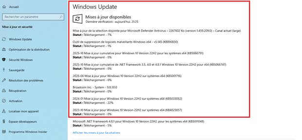
*Figure 21 — Téléchargement et installation des mises à jour.*

Le poste est redémarré à la fin de l'installation, pour les mises à jour qui l'exigent.

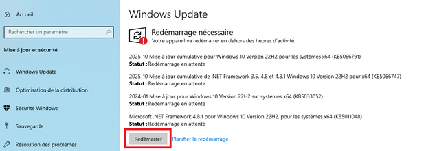
*Figure 22 — Redémarrage du poste à l'issue des mises à jour.*

---

## 7. Cloisonnement des dossiers personnels (permissions NTFS)

### 7.1 Vérification des profils utilisateurs

Après une première connexion de chaque élève, Windows a généré automatiquement leur dossier de profil dans `C:\Users`. La présence des dossiers **Abi Kanthavel**, **Ardit Katana** et **David Rey** confirme que les trois comptes sont opérationnels et prêts à recevoir les permissions NTFS.

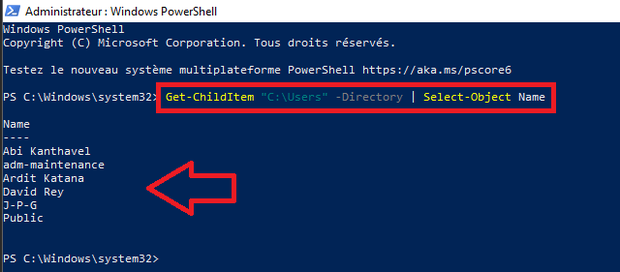
*Figure 23 — Dossiers de profil générés dans C:\Users.*

### 7.2 Application des droits NTFS

Le script PowerShell suivant applique les permissions sur les trois profils :

```powershell
$utilisateurs = "David Rey", "Abi Kanthavel", "Ardit Katana"

foreach ($user in $utilisateurs) {
    $chemin = "C:\Users\$user"
    icacls $chemin /inheritance:r
    icacls $chemin /grant:r "${user}:(OI)(CI)F"
    icacls $chemin /grant:r "SYSTEM:(OI)(CI)F"
    icacls $chemin /grant:r "Administrateurs:(OI)(CI)F"
}
```

Détail des options utilisées :

| Option | Signification |
| --- | --- |
| `icacls` | Outil Windows de gestion des listes de contrôle d'accès (ACL) sur les fichiers et dossiers. |
| `/inheritance:r` | Supprime l'héritage : le dossier cesse de recevoir les droits du dossier parent et ne conserve que les droits explicitement définis ensuite. C'est l'étape qui rend le cloisonnement possible. |
| `/grant:r` | Accorde un droit en **remplaçant** les droits existants de l'utilisateur concerné (au lieu de les cumuler). |
| `(OI)` | *Object Inherit* — le droit est hérité par les **fichiers** contenus dans le dossier. |
| `(CI)` | *Container Inherit* — le droit est hérité par les **sous-dossiers**. |
| `F` | *Full control* — contrôle total (lecture, écriture, modification, suppression, changement des droits). |
| `SYSTEM` | Compte système de Windows : son accès est indispensable au fonctionnement du profil. |
| `Administrateurs` | Groupe conservé pour permettre la maintenance et les sauvegardes du poste. |

Toutes les opérations `icacls` se sont terminées avec succès (0 échec).

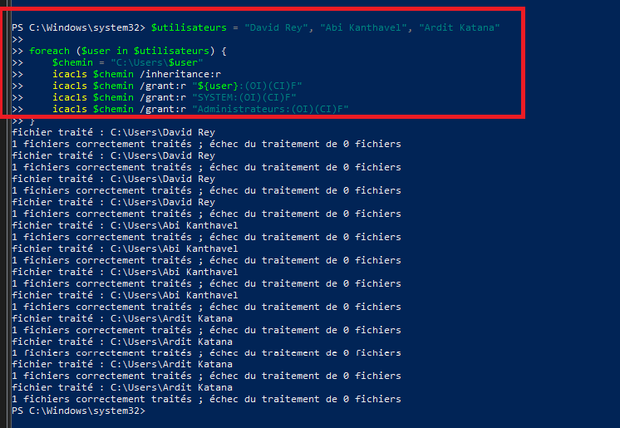
*Figure 24 — Application des permissions NTFS sur les trois profils.*

### 7.3 Vérification des droits appliqués

```powershell
foreach ($user in $utilisateurs) {
    Write-Host "=== $user ==="
    icacls "C:\Users\$user"
}
```

La vérification confirme que, pour chaque dossier, seuls le propriétaire du profil, `SYSTEM` et le groupe `Administrateurs` disposent d'un contrôle total. Les autres utilisateurs n'apparaissent plus dans la liste : le cloisonnement est en place.

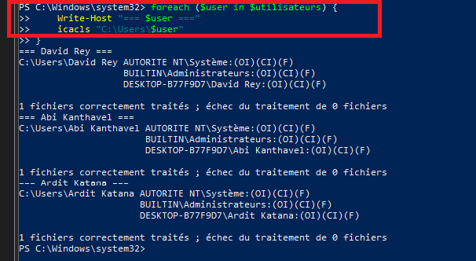
*Figure 25 — Vérification des permissions NTFS appliquées.*

### 7.4 Premier test d'accès

Depuis une session utilisateur standard, je tente d'ouvrir le dossier personnel d'un autre élève (Abi Kanthavel) en passant par la commande **Exécuter**.

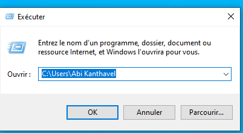
*Figure 26 — Tentative d'accès au dossier d'un autre utilisateur.*

Windows refuse l'accès avec le message « Vous ne disposez pas des autorisations requises pour accéder à ce dossier », ce qui valide la configuration NTFS appliquée précédemment.

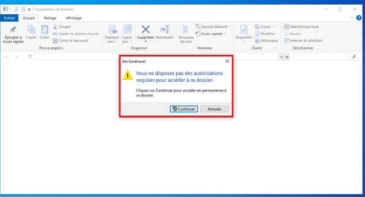
*Figure 27 — Accès refusé au dossier d'un autre utilisateur.*

En cliquant sur **Continuer**, le système demande des identifiants administrateur : l'élève, qui ne les possède pas, ne peut pas aller plus loin.

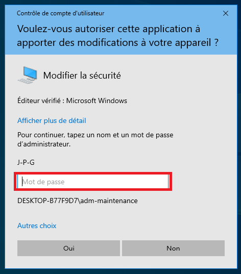
*Figure 28 — Le bouton « Continuer » exige des identifiants administrateur.*

Le même mécanisme s'applique à l'invite de commandes : la lancer en tant qu'administrateur depuis une session élève déclenche également une demande de mot de passe administrateur.

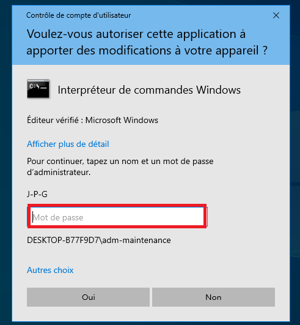
*Figure 29 — Le contrôle de compte d'utilisateur (UAC) bloque l'élévation depuis une session élève.*

---

## 8. Verrouillage automatique de la session après inactivité

### 8.1 Ouverture de la stratégie de sécurité locale

La console de stratégie de sécurité locale s'ouvre avec **Windows + R**, puis la commande `secpol.msc`.

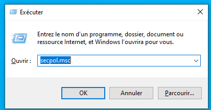
*Figure 30 — Ouverture de la console secpol.msc.*

### 8.2 Recherche du paramètre

Dans le panneau de gauche, je déplie **Stratégies locales**, puis je clique sur **Options de sécurité**. Dans la liste de droite, je recherche le paramètre nommé exactement « Ouverture de session interactive : limite d'inactivité de l'ordinateur ».

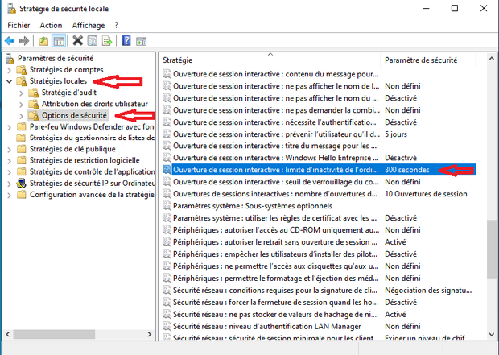
*Figure 31 — Localisation du paramètre dans « Options de sécurité ».*

### 8.3 Configuration du délai

Le délai est fixé à **300 secondes**, soit 5 minutes : au-delà de cette durée sans activité, l'ordinateur se verrouille et demande à nouveau le mot de passe de la session en cours.

Ce paramètre s'applique au niveau de la machine : il concerne donc automatiquement l'ensemble des comptes du poste, les trois comptes élèves comme les comptes administrateurs. C'est une protection importante dans une salle de classe, où un élève peut quitter son poste sans verrouiller sa session et laisser ses fichiers accessibles au suivant.

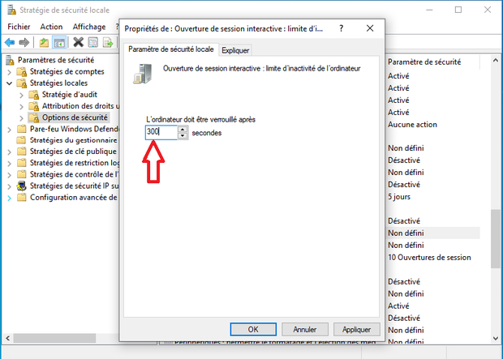
*Figure 32 — Limite d'inactivité fixée à 300 secondes (5 minutes).*

---

## 9. Politique de mots de passe

Toujours dans `secpol.msc`, je déplie **Stratégies de comptes** puis je clique sur **Stratégie de mot de passe**.

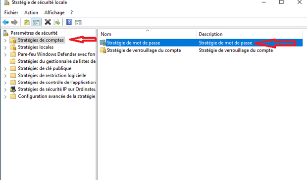
*Figure 33 — Accès à la « Stratégie de mot de passe ».*

Les paramètres suivants ont été appliqués pour renforcer la sécurité des comptes :

| Paramètre | Valeur | Effet |
| --- | --- | --- |
| Longueur minimale du mot de passe | 8 caractères | Rend les attaques par recherche exhaustive nettement plus longues. |
| Exigences de complexité | Activées | Impose de mélanger majuscules, minuscules, chiffres et caractères spéciaux. |
| Conserver l'historique des mots de passe | 5 mots de passe | Empêche de réutiliser immédiatement un ancien mot de passe. |
| Durée de vie minimale | 1 jour | Empêche de contourner l'historique en changeant cinq fois de mot de passe d'affilée. |
| Durée de vie maximale | 360 jours | Force un renouvellement périodique. |
| Chiffrement réversible | Désactivé | Les mots de passe ne sont jamais stockés en clair sur le disque. |

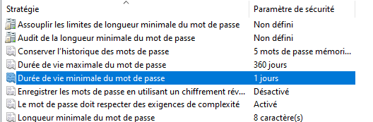
*Figure 34 — Paramètres de mot de passe appliqués.*

Ces réglages s'appliquent au niveau de la machine et concernent donc l'ensemble des comptes locaux, élèves comme administrateurs.

> [!NOTE]
> **Piste d'amélioration.** Une durée de vie maximale de 360 jours est longue pour un poste partagé. Une valeur de 90 jours correspondrait mieux aux recommandations habituelles pour un environnement à plusieurs utilisateurs.

---

## 10. Politique de verrouillage de compte

Juste en dessous, dans **Stratégies de comptes**, je clique sur **Stratégie de verrouillage du compte**. Cette politique protège contre les attaques par force brute, c'est-à-dire les tentatives répétées de deviner un mot de passe.

| Paramètre | Valeur | Effet |
| --- | --- | --- |
| Seuil de verrouillage du compte | 5 tentatives | Le compte se bloque après 5 échecs de connexion consécutifs. |
| Durée de verrouillage des comptes | 30 minutes | Durée pendant laquelle le compte reste bloqué avant réactivation automatique. |
| Réinitialiser le compteur après | 30 minutes | Délai au bout duquel le compteur d'échecs revient à zéro. |
| Autoriser le verrouillage du compte Administrateur | Activé | Le compte administrateur local est soumis à la même protection. |

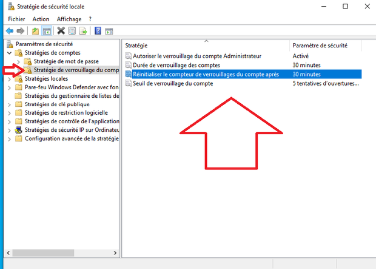
*Figure 35 — Paramètres de verrouillage de compte appliqués.*

Ces paramètres s'appliquent eux aussi au niveau de la machine et concernent donc tous les comptes locaux.

---

## 11. Tests croisés de cloisonnement

Pour valider l'ensemble de la configuration, je me suis connecté successivement avec chaque compte élève et j'ai tenté d'ouvrir, depuis l'Explorateur de fichiers, le dossier personnel de chacun de ses camarades. Dans les trois cas, l'accès est refusé et Windows réclame des identifiants administrateur que les élèves ne possèdent pas.

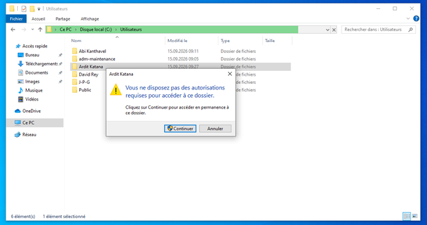
*Figure 36 — Depuis la session **Abi Kanthavel**, l'accès au dossier d'**Ardit Katana** est refusé.*

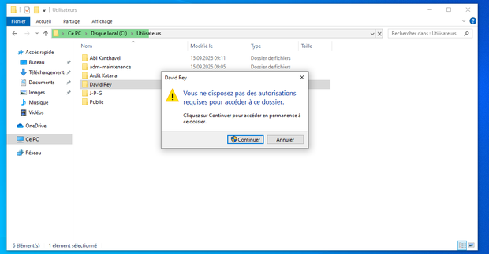
*Figure 37 — Depuis la session **Ardit Katana**, l'accès au dossier de **David Rey** est refusé.*

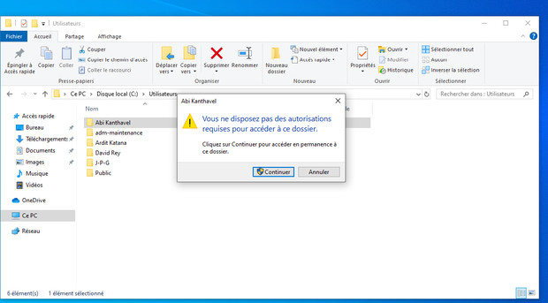
*Figure 38 — Depuis la session **David Rey**, l'accès au dossier d'**Abi Kanthavel** est refusé.*

### 11.1 Récapitulatif des tests

| Test | Résultat attendu | Résultat obtenu |
| --- | --- | --- |
| Abi Kanthavel → dossier d'Ardit Katana | Accès refusé | Refusé ✔ |
| Ardit Katana → dossier de David Rey | Accès refusé | Refusé ✔ |
| David Rey → dossier d'Abi Kanthavel | Accès refusé | Refusé ✔ |
| Élève → invite de commandes en administrateur | Mot de passe administrateur exigé | Exigé ✔ |
| Élève → accès à son propre dossier personnel | Accès autorisé | Autorisé ✔ |

---

## 12. Conclusion

Tous les objectifs du projet sont atteints. Le poste dispose de trois comptes élèves standards et d'un compte administrateur dédié à la maintenance, séparé de l'usage quotidien. Les dossiers personnels sont cloisonnés par des permissions NTFS, ce qui a été vérifié dans les deux sens : chaque élève accède à son dossier et se voit refuser celui des autres. La session se verrouille automatiquement après cinq minutes d'inactivité, et une politique de mots de passe et de verrouillage de compte protège les comptes contre les tentatives de connexion répétées.

**Ce que j'ai appris.** La partie la plus instructive a été la gestion des droits NTFS : tant que l'héritage n'est pas supprimé avec `/inheritance:r`, les droits du dossier parent continuent de s'appliquer et le cloisonnement ne fonctionne pas. J'ai aussi compris la différence entre un droit accordé à un utilisateur et un droit accordé à un groupe, et pourquoi il faut toujours conserver `SYSTEM` et `Administrateurs` sous peine de rendre le profil inutilisable.

**Améliorations possibles.**

- Ramener la durée de vie maximale des mots de passe de 360 à 90 jours.
- Activer l'audit des accès refusés, afin de garder une trace des tentatives d'accès entre comptes.
- Mettre en place des quotas de disque par utilisateur pour éviter qu'un élève ne sature le disque.
- Créer un point de restauration ou un instantané (*snapshot*) de la machine virtuelle une fois la configuration terminée.

---

## Annexe A — Identifiants de la machine virtuelle de démonstration

> [!NOTE]
> Les mots de passe de la machine virtuelle de démonstration ont été retirés de cette version publique. Ils ont été remis séparément au formateur.

---

## Annexe B — Récapitulatif des commandes utilisées

| Commande | Rôle |
| --- | --- |
| `Net User <compte> <mot_de_passe>` | Attribue ou modifie le mot de passe d'un compte local. |
| `New-LocalUser` | Crée un compte local (nom, nom complet, description, mot de passe). |
| `Read-Host -AsSecureString` | Demande un mot de passe de façon masquée, sans l'écrire en clair. |
| `Add-LocalGroupMember -Group "Administrateurs"` | Ajoute un compte au groupe des administrateurs locaux. |
| `Get-LocalGroupMember -Group "Administrateurs"` | Affiche les membres du groupe des administrateurs locaux. |
| `icacls <dossier> /inheritance:r` | Supprime l'héritage des droits du dossier parent. |
| `icacls <dossier> /grant:r "<compte>:(OI)(CI)F"` | Accorde un contrôle total, hérité par les fichiers et sous-dossiers. |
| `secpol.msc` | Ouvre la console de stratégie de sécurité locale. |
