# Projet 3 — Migration et sauvegarde d'un poste existant

**Réinstallation complète d'un poste Windows 10 Pro sans perte de données**

Jean-Pierre Gallego Santillan · IT Essentials ICT-187 · Classe E1A · Formateur : M. Morrad · Septembre 2026

---

## Sommaire

- [1. Présentation du projet](#1-présentation-du-projet)
  - [1.1 Objectifs](#11-objectifs)
  - [1.2 Environnement de travail](#12-environnement-de-travail)
  - [1.3 Déroulement](#13-déroulement)
  - [1.4 Correspondance avec les livrables](#14-correspondance-avec-les-livrables)
- [2. Étape 1 — Inventaire des données à conserver](#2-étape-1--inventaire-des-données-à-conserver)
  - [2.1 Dossiers personnels de l'utilisateur](#21-dossiers-personnels-de-lutilisateur)
  - [2.2 Emplacement des favoris et du profil du navigateur](#22-emplacement-des-favoris-et-du-profil-du-navigateur)
  - [2.3 Paramètres réseau](#23-paramètres-réseau)
  - [2.4 Logiciels installés](#24-logiciels-installés)
  - [2.5 Données « cachées » : mails, licences, VPN, certificats](#25-données--cachées---mails-licences-vpn-certificats)
  - [2.6 Comptes utilisateurs et imprimantes](#26-comptes-utilisateurs-et-imprimantes)
- [3. Étape 2 — Sauvegarde sur un support externe](#3-étape-2--sauvegarde-sur-un-support-externe)
  - [3.1 Espace utilisé sur le poste avant la réinstallation](#31-espace-utilisé-sur-le-poste-avant-la-réinstallation)
  - [3.2 Choix du support et vérification de l'espace](#32-choix-du-support-et-vérification-de-lespace)
  - [3.3 Création d'une arborescence datée et copie des données](#33-création-dune-arborescence-datée-et-copie-des-données)
  - [3.4 Export des favoris du navigateur au format HTML](#34-export-des-favoris-du-navigateur-au-format-html)
  - [3.5 Sauvegarde de la liste des logiciels et de la configuration réseau](#35-sauvegarde-de-la-liste-des-logiciels-et-de-la-configuration-réseau)
  - [3.6 Contenu de la sauvegarde](#36-contenu-de-la-sauvegarde)
- [4. Étape 3 — Vérification de l'intégrité de la sauvegarde](#4-étape-3--vérification-de-lintégrité-de-la-sauvegarde)
  - [4.1 Propriétés du dossier source](#41-propriétés-du-dossier-source)
  - [4.2 Propriétés du dossier de destination](#42-propriétés-du-dossier-de-destination)
  - [4.3 Comparaison](#43-comparaison)
  - [4.4 Test d'ouverture d'un fichier](#44-test-douverture-dun-fichier)
- [5. Étape 4 — Réinstallation propre du système](#5-étape-4--réinstallation-propre-du-système)
  - [5.1 Support d'installation : ISO monté à la place d'une clé bootable](#51-support-dinstallation--iso-monté-à-la-place-dune-clé-bootable)
  - [5.2 Effacement complet du disque](#52-effacement-complet-du-disque)
  - [5.3 Installation de Windows 10 Pro](#53-installation-de-windows-10-pro)
  - [5.4 Application de toutes les mises à jour](#54-application-de-toutes-les-mises-à-jour)
  - [5.5 Installation des pilotes manquants (VMware Tools)](#55-installation-des-pilotes-manquants-vmware-tools)
- [6. Étape 5 — Réinstallation des logiciels](#6-étape-5--réinstallation-des-logiciels)
  - [6.1 Réinstaller uniquement les logiciels identifiés](#61-réinstaller-uniquement-les-logiciels-identifiés)
  - [6.2 Ressaisir les licences et clés produit](#62-ressaisir-les-licences-et-clés-produit)
  - [6.3 Vérifier que les logiciels sont bien installés](#63-vérifier-que-les-logiciels-sont-bien-installés)
- [7. Étape 6 — Restauration des données et vérification](#7-étape-6--restauration-des-données-et-vérification)
  - [7.1 Recopie des données vers les dossiers d'origine](#71-recopie-des-données-vers-les-dossiers-dorigine)
  - [7.2 Réimportation des favoris dans le navigateur](#72-réimportation-des-favoris-dans-le-navigateur)
  - [7.3 Comparaison et validation par l'utilisateur](#73-comparaison-et-validation-par-lutilisateur)
- [8. Étape 7 — Reconfiguration des paramètres essentiels](#8-étape-7--reconfiguration-des-paramètres-essentiels)
  - [8.1 Réseau](#81-réseau)
  - [8.2 Imprimante : installation et test d'impression](#82-imprimante--installation-et-test-dimpression)
  - [8.3 Comptes utilisateurs : création, droits et mot de passe](#83-comptes-utilisateurs--création-droits-et-mot-de-passe)
  - [8.4 Comptes mail, VPN, partages réseau et sauvegarde automatique](#84-comptes-mail-vpn-partages-réseau-et-sauvegarde-automatique)
- [9. Étape 8 — Procédure de migration réutilisable](#9-étape-8--procédure-de-migration-réutilisable)
  - [9.1 Procédure numérotée](#91-procédure-numérotée)
  - [9.2 Points de vigilance et pièges rencontrés](#92-points-de-vigilance-et-pièges-rencontrés)
- [10. Conclusion](#10-conclusion)
- [Annexe — Récapitulatif des commandes utilisées](#annexe--récapitulatif-des-commandes-utilisées)

# 1. Présentation du projet

Un poste de travail vieillissant doit être entièrement réinstallé. L'utilisateur doit retrouver, après l'opération, tous ses documents, ses favoris et ses paramètres essentiels. La mission consiste donc à réaliser une migration complète **sans aucune perte de données**, puis à documenter la procédure pour qu'elle puisse être refaite sur un autre poste.

Pour ce projet, je suis reparti de la machine virtuelle du Projet 2 (poste multi-utilisateurs), qui contient déjà les trois comptes élèves et le compte d'administration. Cette machine joue le rôle du « vieux poste » à migrer.

## 1.1 Objectifs

- Réaliser un inventaire et une sauvegarde complète des données utilisateur avant la réinstallation.
- Effectuer une réinstallation propre du système d'exploitation.
- Restaurer les données et reconfigurer les paramètres essentiels après l'installation.
- Documenter une procédure de migration reproductible.

## 1.2 Environnement de travail

| Élément | Valeur |
| --- | --- |
| Hyperviseur | VMware Workstation Pro 17 |
| Machine virtuelle | VM_Etudiant_PPE (reprise du Projet 2) |
| Système | Windows 10 Pro 64 bits, version 22H2 (ISO `Win10_22H2_French_x64.iso`, 5,73 Go) |
| Matériel virtuel | 8 Go de RAM, 2 cœurs, disque NVMe de 75 Go |
| Support de sauvegarde | Clé USB LogiLink UDisk de 4 Go (3,74 Go utilisables), lecteur E: |
| Comptes présents | J-P-G, adm-maintenance, David Rey, Abi Kanthavel, Ardit Katana |
| Outils utilisés | PowerShell (administrateur), Explorateur de fichiers, Microsoft Edge, Panneau de configuration |

## 1.3 Déroulement

| Étape | Contenu | Date |
| --- | --- | --- |
| 1 | Inventaire des données à conserver | 15.09.2026 |
| 2 | Sauvegarde sur la clé USB | 16.09.2026 |
| 3 | Vérification de l'intégrité de la sauvegarde | 16.09.2026 |
| 4 | Réinstallation propre du système | 16.09.2026 |
| 5 | Réinstallation des logiciels | 16.09.2026 |
| 6 | Restauration des données et vérification | 16.09.2026 |
| 7 | Reconfiguration des paramètres essentiels | 17.09.2026 |
| 8 | Procédure de migration réutilisable (chapitre 9) | 17.09.2026 |

## 1.4 Correspondance avec les livrables

| Livrable demandé | Où le trouver dans ce rapport |
| --- | --- |
| Preuve de sauvegarde : liste des fichiers + espace utilisé avant réinstallation | Sections 3.1, 3.5 et 3.6 (figures 13 à 15, 23 à 25) |
| Poste réinstallé avec les données restaurées | Chapitres 5, 6, 7 et 8 |
| Procédure de migration réutilisable avec étapes numérotées et points de vigilance | Chapitre 9 |

# 2. Étape 1 — Inventaire des données à conserver

Avant de toucher au disque, il faut savoir exactement **ce qui doit survivre** à la réinstallation. Toutes les commandes de cette étape sont lancées dans PowerShell ouvert en tant qu'administrateur, depuis le compte adm-maintenance.

## 2.1 Dossiers personnels de l'utilisateur

La variable `$env:USERPROFILE` contient le chemin du profil de l'utilisateur connecté (ici `C:\Users\adm-maintenance`). La commande `dir` affiche le contenu de chaque dossier personnel :

```powershell
dir "$env:USERPROFILE\Documents"
dir "$env:USERPROFILE\Desktop"
dir "$env:USERPROFILE\Pictures"
dir "$env:USERPROFILE\Downloads"
dir "$env:USERPROFILE\Videos"
dir "$env:USERPROFILE\Music"
```

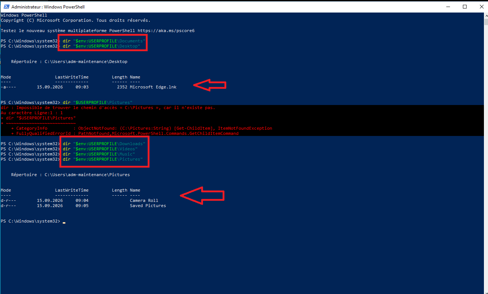
*Figure 1 — Inventaire des dossiers personnels ; le Bureau contient le raccourci Microsoft Edge.lnk, Images contient Camera Roll et Saved Pictures.*

> [!WARNING]
> **Piège rencontré.** Pour le dossier Images, j'ai d'abord tapé `dir "$USERPROFILE\Pictures"` en oubliant `env:`. PowerShell a alors cherché une variable `$USERPROFILE` qui n'existe pas, l'a remplacée par du vide et a cherché `C:\Pictures` : d'où le message rouge « Impossible de trouver le chemin d'accès ». Une fois la commande corrigée avec `$env:USERPROFILE`, le dossier s'affiche correctement.

## 2.2 Emplacement des favoris et du profil du navigateur

Le navigateur utilisé est Microsoft Edge. Son profil (favoris, historique, préférences) est stocké dans le dossier AppData de l'utilisateur :

```powershell
dir "$env:LOCALAPPDATA\Microsoft\Edge\User Data\Default"
```

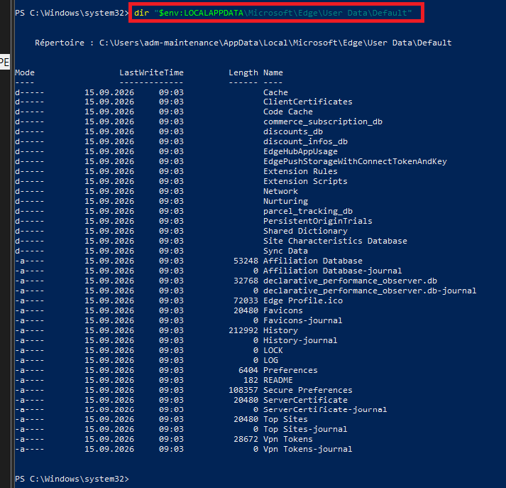
*Figure 2 — Profil Edge localisé dans C:\Users\adm-maintenance\AppData\Local\Microsoft\Edge\User Data\Default.*

On y retrouve notamment les fichiers **History** (historique), **Favicons**, **Preferences** et **Top Sites**. Le fichier des favoris s'appelle `Bookmarks` ; il n'est créé qu'à partir du moment où un favori a été enregistré. Plutôt que de copier ce dossier (dont certains fichiers sont verrouillés quand Edge est ouvert), les favoris seront exportés au format HTML à l'étape 2.

## 2.3 Paramètres réseau

```powershell
ipconfig /all
```

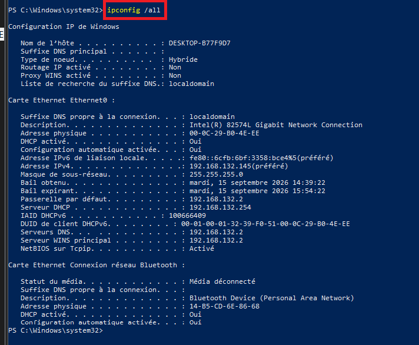
*Figure 3 — Configuration IP du poste avant la réinstallation.*

| Paramètre | Valeur relevée |
| --- | --- |
| Nom d'hôte | DESKTOP-B77F9D7 |
| Mode d'adressage | DHCP activé (pas d'IP fixe) |
| Adresse IPv4 | 192.168.132.145 |
| Masque de sous-réseau | 255.255.255.0 |
| Passerelle par défaut | 192.168.132.2 |
| Serveur DNS | 192.168.132.2 |
| Serveur DHCP | 192.168.132.254 |
| Carte réseau | Ethernet — Intel 82574L (adresse physique 00-0C-29-B0-4E-EE) |
| Wi-Fi / Bluetooth | Pas de Wi-Fi ; carte Bluetooth présente mais déconnectée |

> [!NOTE]
> **Remarque.** Le poste étant en DHCP, il n'y a aucune adresse à ressaisir après la réinstallation. Si le poste avait eu une IP fixe, ces valeurs auraient dû être notées sur papier ou sur un autre appareil, car elles sont perdues au formatage.

## 2.4 Logiciels installés

```powershell
winget list
```

Lors de la première utilisation, winget demande d'accepter les conditions d'utilisation de la source « msstore ». On répond **Y** (oui) pour continuer.

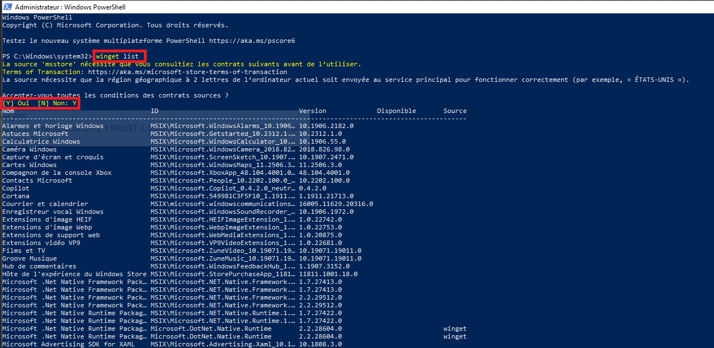
*Figure 4 — Première exécution de winget list : acceptation des conditions de la source msstore.*

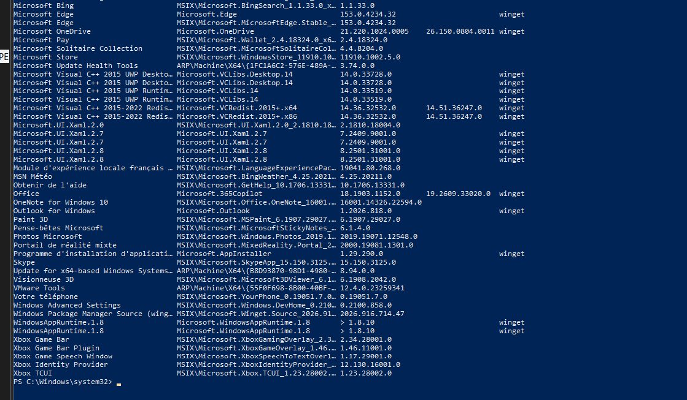
*Figure 5 — Liste des logiciels installés renvoyée par winget (Edge, OneDrive, Visual C++ Redistributable, VMware Tools…).*

La liste contient beaucoup d'applications intégrées à Windows (Calculatrice, Photos, Xbox…) qui seront réinstallées automatiquement avec le système. Les logiciels à réinstaller manuellement sont surtout les **Microsoft Visual C++ Redistributable**.

## 2.5 Données « cachées » : mails, licences, VPN, certificats

**Mails locaux (Outlook).** Si Outlook est configuré, ses fichiers de données (.pst/.ost) se trouvent dans le dossier suivant :

```powershell
dir "$env:LOCALAPPDATA\Microsoft\Outlook"
```

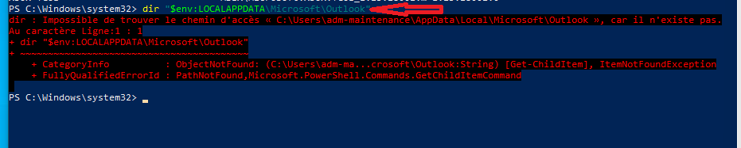
*Figure 6 — Le dossier Outlook n'existe pas : aucun mail local à sauvegarder.*

**Clé produit Windows.** Sur un PC du commerce, la clé est souvent inscrite dans le firmware (clé OEM) et peut être lue avec cette commande :

```powershell
(Get-WmiObject -query 'select * from SoftwareLicensingService').OA3xOriginalProductKey
```

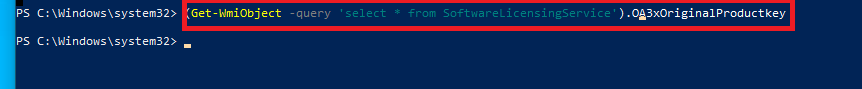
*Figure 7 — La commande ne renvoie aucune clé : normal sur une machine virtuelle, qui n'a pas de firmware OEM.*

**État de l'activation.** La commande `slmgr /xpr` indique si Windows est activé :

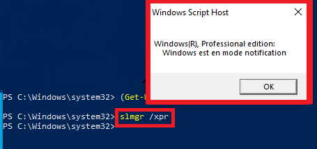
*Figure 8 — Windows 10 Professionnel est « en mode notification », c'est-à-dire non activé.*

**Profils VPN.**

```powershell
Get-VpnConnection
```

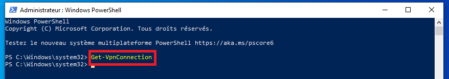
*Figure 9 — Get-VpnConnection ne renvoie rien : aucune connexion VPN configurée.*

**Certificats.** On contrôle le magasin de certificats personnels de l'utilisateur, puis celui de la machine :

```powershell
Get-ChildItem -Path Cert:\CurrentUser\My
Get-ChildItem -Path Cert:\LocalMachine\My
```

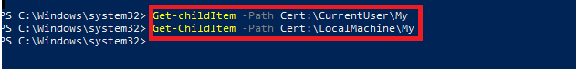
*Figure 10 — Aucun certificat personnel, ni côté utilisateur ni côté machine.*

| Élément | Résultat | Action à prévoir |
| --- | --- | --- |
| Mails locaux (Outlook) | Aucun (dossier inexistant) | Aucune |
| Clé produit OEM | Aucune (VM) | Aucune clé à ressaisir |
| Activation Windows | Mode notification (non activé) | Contrôler après la réinstallation |
| Profils VPN | Aucun | Aucune |
| Certificats | Aucun | Aucune |

> [!NOTE]
> **Remarque.** Sur ma VM, ces éléments sont vides, mais je les ai quand même vérifiés car ils font partie de la consigne : sur un vrai poste d'entreprise, ce sont justement les oublis les plus fréquents.

## 2.6 Comptes utilisateurs et imprimantes

```powershell
Get-LocalUser
```

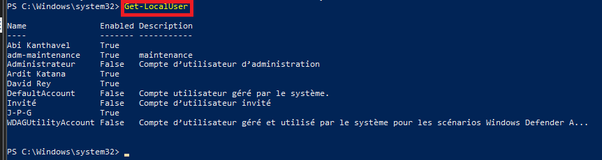
*Figure 11 — Comptes locaux du poste ; la colonne Enabled indique s'ils sont actifs.*

Les comptes actifs à recréer sont **J-P-G**, **adm-maintenance**, **David Rey**, **Abi Kanthavel** et **Ardit Katana**. Les comptes Administrateur, DefaultAccount, Invité et WDAGUtilityAccount sont des comptes intégrés de Windows, désactivés (False) : ils seront recréés automatiquement.

```powershell
Get-Printer
```

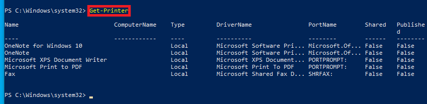
*Figure 12 — Imprimantes installées : uniquement des imprimantes virtuelles (OneNote, XPS, Print to PDF, Fax).*

Aucune imprimante physique n'est installée ; il n'y a donc pas de pilote d'imprimante à récupérer.

# 3. Étape 2 — Sauvegarde sur un support externe

## 3.1 Espace utilisé sur le poste avant la réinstallation

Dans l'Explorateur de fichiers, **Ce PC** affiche l'espace libre et total de chaque lecteur sous forme de barre.

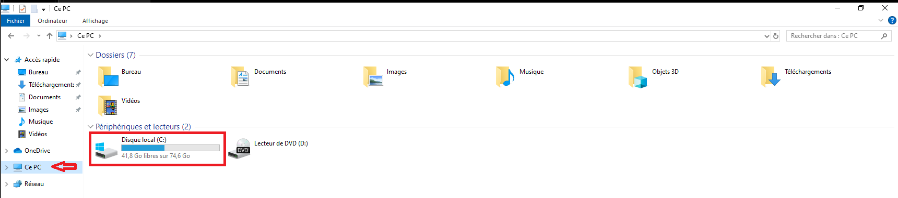
*Figure 13 — Vue « Ce PC » : espace du disque local C: avant la réinstallation.*

Pour obtenir les valeurs exactes : clic droit sur le lecteur C:, puis **Propriétés**.

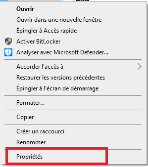
*Figure 14 — Menu contextuel du disque local : option « Propriétés ».*

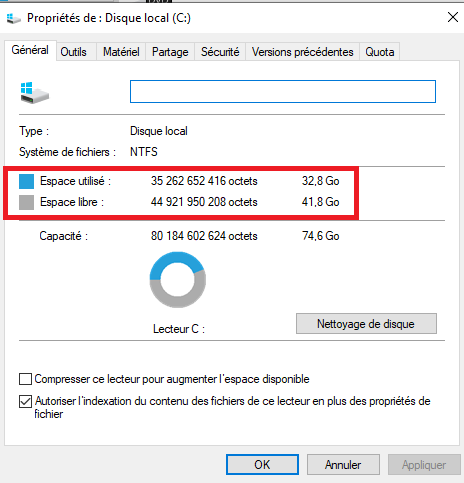
*Figure 15 — Preuve avant réinstallation : 32,8 Go utilisés, 41,8 Go libres sur 74,6 Go.*

Cette capture fait partie des livrables : elle ne pourra plus être refaite une fois le disque effacé.

## 3.2 Choix du support et vérification de l'espace

Le support retenu est une **clé USB LogiLink UDisk**, connectée à la machine virtuelle depuis VMware Workstation (menu VM → Removable Devices → Connect). Elle apparaît dans Windows comme **Lecteur USB (E:)**, avec 3,74 Go libres.

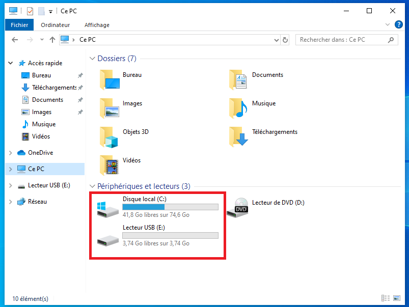
*Figure 16 — La clé USB (E:) est reconnue par la VM : 3,74 Go libres sur 3,74 Go.*

Pour vérifier que les données tiennent sur la clé, la taille totale du profil est calculée avec PowerShell :

```powershell
(Get-ChildItem -Path "$env:USERPROFILE" -Recurse -ErrorAction SilentlyContinue |
  Measure-Object -Property Length -Sum).Sum / 1GB
```

`Get-ChildItem -Recurse` parcourt tous les fichiers du profil, `Measure-Object -Sum` additionne leur taille, et la division par `1GB` convertit le résultat en gigaoctets. Le volume obtenu est quasi nul (profil peu utilisé), et les profils des élèves sont encore plus légers : les **3,74 Go** de la clé sont largement suffisants.

## 3.3 Création d'une arborescence datée et copie des données

Un dossier daté est créé sur la clé, avec un sous-dossier par type de données. La date dans le nom permet de retrouver immédiatement quelle sauvegarde est la plus récente.

```powershell
New-Item -Path "E:\Sauvegarde_2026-09-16" -ItemType Directory -Force
New-Item -Path "E:\Sauvegarde_2026-09-16\Documents" -ItemType Directory -Force
New-Item -Path "E:\Sauvegarde_2026-09-16\Bureau" -ItemType Directory -Force
New-Item -Path "E:\Sauvegarde_2026-09-16\Images" -ItemType Directory -Force
New-Item -Path "E:\Sauvegarde_2026-09-16\Telechargements" -ItemType Directory -Force
New-Item -Path "E:\Sauvegarde_2026-09-16\Config" -ItemType Directory -Force
```

Les données sont ensuite copiées dans les dossiers correspondants :

```powershell
Copy-Item "$env:USERPROFILE\Documents\*" -Destination "E:\Sauvegarde_2026-09-16\Documents" -Recurse -ErrorAction SilentlyContinue
Copy-Item "$env:USERPROFILE\Desktop\*"   -Destination "E:\Sauvegarde_2026-09-16\Bureau" -Recurse -ErrorAction SilentlyContinue
Copy-Item "$env:USERPROFILE\Pictures\*"  -Destination "E:\Sauvegarde_2026-09-16\Images" -Recurse -ErrorAction SilentlyContinue
Copy-Item "$env:USERPROFILE\Downloads\*" -Destination "E:\Sauvegarde_2026-09-16\Telechargements" -Recurse -ErrorAction SilentlyContinue
```

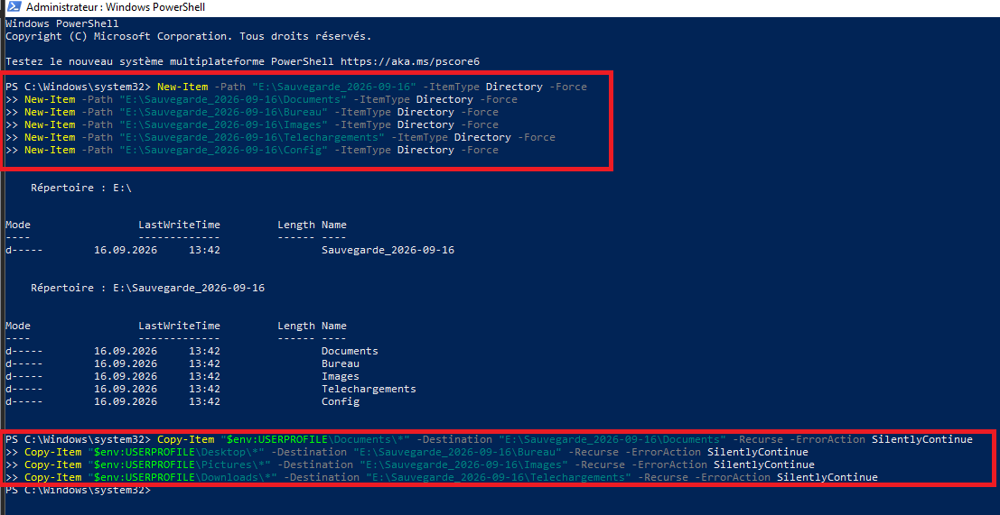
*Figure 17 — Création de l'arborescence datée (en haut) puis lancement des copies (en bas).*

| Élément | Rôle |
| --- | --- |
| `New-Item -ItemType Directory` | Crée un dossier. `-Force` évite une erreur si le dossier existe déjà. |
| `Copy-Item … \*` | Copie tout le contenu du dossier source (l'étoile désigne tous les éléments). |
| `-Recurse` | Copie aussi les sous-dossiers et leur contenu. |
| `-ErrorAction SilentlyContinue` | N'affiche pas les erreurs (fichiers verrouillés, par exemple). |

> [!WARNING]
> **Point de vigilance.** `-ErrorAction SilentlyContinue` masque les erreurs : une copie peut donc échouer sans que rien ne s'affiche. C'est pour cette raison que la sauvegarde doit obligatoirement être vérifiée à l'étape 3.

## 3.4 Export des favoris du navigateur au format HTML

1. Ouvrir Microsoft Edge, cliquer sur les trois points « … » en haut à droite puis sur **Favoris** (raccourci : Ctrl + Maj + O).

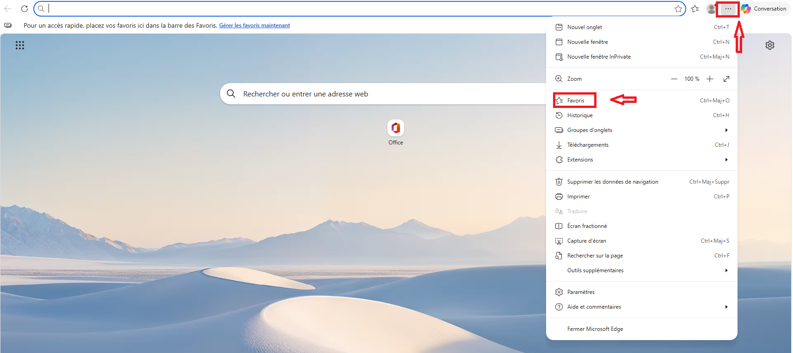
*Figure 18 — Menu d'Edge : entrée « Favoris ».*

2. Dans le panneau des favoris, cliquer à nouveau sur les trois points « … ».

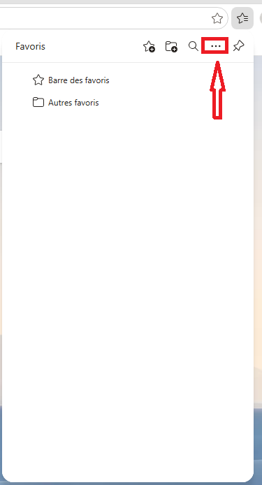
*Figure 19 — Panneau des favoris : bouton « … » en haut du panneau.*

3. Choisir **Exporter les favoris**.

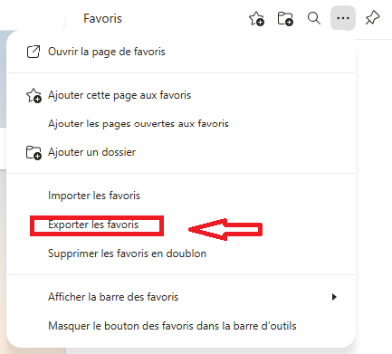
*Figure 20 — Option « Exporter les favoris ».*

4. Choisir l'emplacement sur la clé USB et enregistrer le fichier `favorites_16_09_2026.html`.

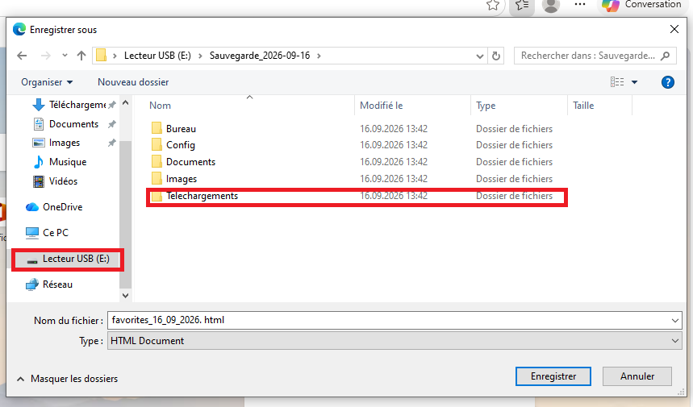
*Figure 21 — Enregistrement du fichier de favoris sur la clé USB.*

> [!WARNING]
> **Point de vigilance.** Le sous-dossier **Config** avait été créé exprès pour ce fichier, mais il a finalement été enregistré dans **Telechargements**. Ce n'est pas bloquant (le fichier a bien été retrouvé à l'étape 6), mais pour une procédure propre, il faut le ranger dans Config. De plus, un espace a été tapé avant l'extension (`favorites_16_09_2026. html`), si bien que Windows a ajouté un second « .html » au nom du fichier (voir figure 72).

## 3.5 Sauvegarde de la liste des logiciels et de la configuration réseau

Les résultats des commandes d'inventaire sont redirigés vers des fichiers texte grâce à l'opérateur `>` :

```powershell
winget list  > "E:\Sauvegarde_2026-09-16\Config\logiciels.txt"
ipconfig /all > "E:\Sauvegarde_2026-09-16\Config\reseau.txt"
```

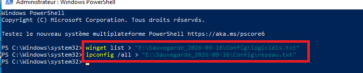
*Figure 22 — Export de la liste des logiciels et de la configuration réseau vers le dossier Config.*

```powershell
dir "E:\Sauvegarde_2026-09-16\Config"
```

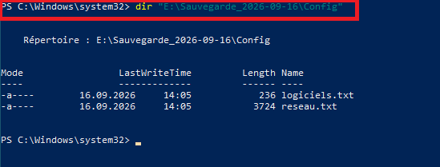
*Figure 23 — Contrôle : les fichiers logiciels.txt (236 octets) et reseau.txt (3 724 octets) sont bien présents.*

Le fichier `logiciels.txt` ne pesait que 236 octets, ce qui est trop peu pour contenir toute la liste. La liste a donc été régénérée en lisant directement le registre de Windows, où chaque programme installé est déclaré :

```powershell
Get-ItemProperty HKLM:\Software\Wow6432Node\Microsoft\Windows\CurrentVersion\Uninstall\* |
  Select-Object DisplayName, DisplayVersion |
  Where-Object { $_.DisplayName -ne $null } |
  Out-File "E:\Sauvegarde_2026-09-16\Config\logiciels.txt"
notepad "E:\Sauvegarde_2026-09-16\Config\logiciels.txt"
```

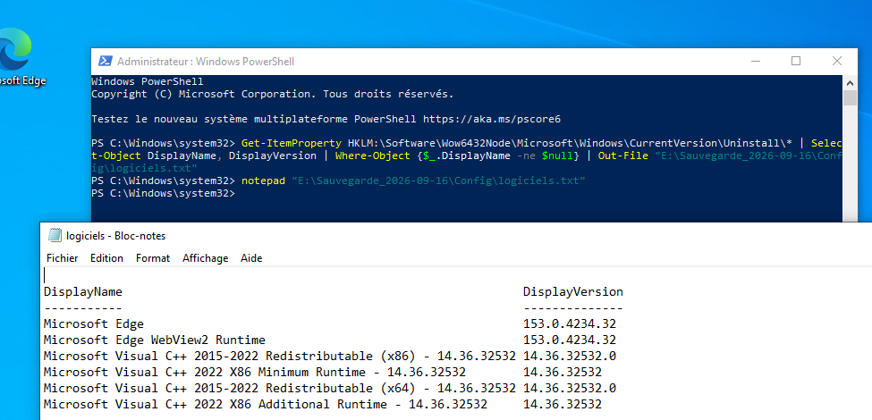
*Figure 24 — Liste des logiciels générée depuis le registre et ouverte dans le Bloc-notes.*

Le fichier contient cette fois la vraie liste : Microsoft Edge, Edge WebView2 Runtime et les différents Microsoft Visual C++ 2015-2022 Redistributable (x86 et x64).

> [!NOTE]
> **Remarque.** La clé `Wow6432Node` ne liste que les programmes 32 bits. Pour une liste complète, il faut aussi interroger `HKLM:\Software\Microsoft\Windows\CurrentVersion\Uninstall\*`.

## 3.6 Contenu de la sauvegarde

```powershell
dir "E:\Sauvegarde_2026-09-16\Documents"
dir "E:\Sauvegarde_2026-09-16\Bureau"
```

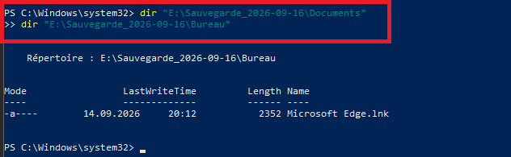
*Figure 25 — Contenu copié sur la clé : le raccourci Microsoft Edge.lnk (2 352 octets) est bien présent dans Bureau.*

# 4. Étape 3 — Vérification de l'intégrité de la sauvegarde

Une sauvegarde n'a de valeur que si elle est **complète et lisible**. On compare donc la source (le poste) et la destination (la clé) : nombre de fichiers, nombre de dossiers et taille totale.

## 4.1 Propriétés du dossier source

1. Ouvrir **Ce PC**, puis **Disque local (C:)**.

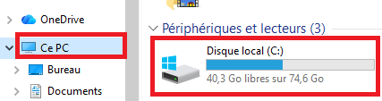
*Figure 26 — Accès au disque local C: depuis « Ce PC ».*

2. Ouvrir **Utilisateurs**, puis le dossier du compte (**J-P-G**).


*Figure 27 — Dossier « Utilisateurs » du disque C:.*

3. Faire un clic droit sur le dossier à contrôler, puis **Propriétés**.

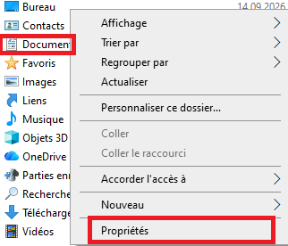
*Figure 28 — Clic droit sur un dossier personnel puis « Propriétés ».*

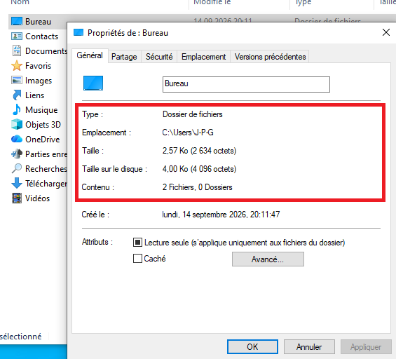
*Figure 29 — Propriétés du Bureau source (C:\Users\J-P-G) : 2,57 Ko (2 634 octets), 2 fichiers, 0 dossier.*

## 4.2 Propriétés du dossier de destination

1. Ouvrir **Ce PC**, puis **Lecteur USB (E:)**.

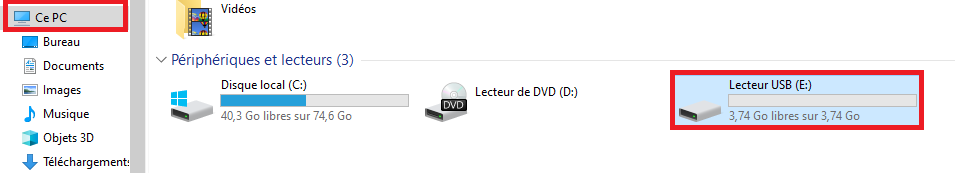
*Figure 30 — Accès au lecteur USB (E:).*

2. Ouvrir le dossier **Sauvegarde_2026-09-16**. On y voit aussi le script `sauvegarde PS1` qui regroupe les commandes utilisées.

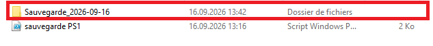
*Figure 31 — Dossier de sauvegarde daté à la racine de la clé.*

3. Clic droit sur le dossier **Bureau** → **Propriétés**.

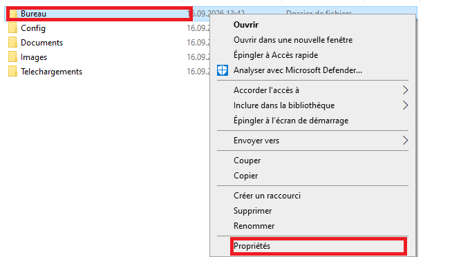
*Figure 32 — Clic droit sur le dossier Bureau de la sauvegarde.*

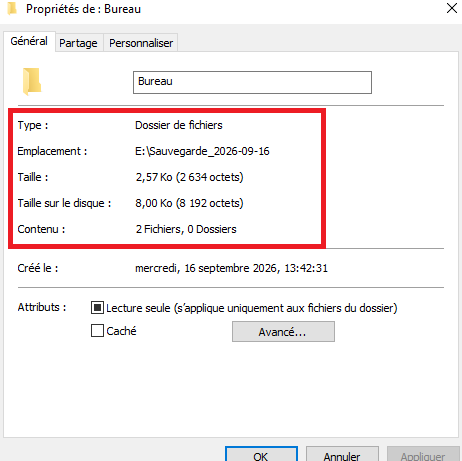
*Figure 33 — Propriétés du Bureau sauvegardé (E:\Sauvegarde_2026-09-16) : 2,57 Ko (2 634 octets), 2 fichiers, 0 dossier.*

## 4.3 Comparaison

| Critère | Source (C:) | Sauvegarde (E:) | Résultat |
| --- | --- | --- | --- |
| Nombre de fichiers | 2 | 2 | Identique ✔ |
| Nombre de dossiers | 0 | 0 | Identique ✔ |
| Taille réelle | 2 634 octets | 2 634 octets | Identique ✔ |
| Taille sur le disque | 4 096 octets | 8 192 octets | Normal (voir remarque) |

Les 2 fichiers correspondent au raccourci **Microsoft Edge.lnk** (2 352 octets) et au fichier caché **desktop.ini** (282 octets) : 2 352 + 282 = 2 634 octets.

> [!NOTE]
> **Remarque.** La « taille sur le disque » est différente parce que la clé USB et le disque C: ne découpent pas l'espace en blocs de la même taille (4 Ko contre 8 Ko). Ce qui compte pour vérifier une copie, c'est la **taille réelle**, qui est identique au octet près.

## 4.4 Test d'ouverture d'un fichier

Dans `E:\Sauvegarde_2026-09-16\Bureau`, un double-clic sur **Microsoft Edge** permet de vérifier que le fichier copié n'est pas corrompu.

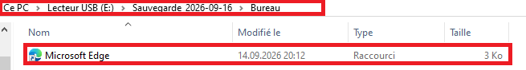
*Figure 34 — Le raccourci Microsoft Edge présent dans la sauvegarde.*

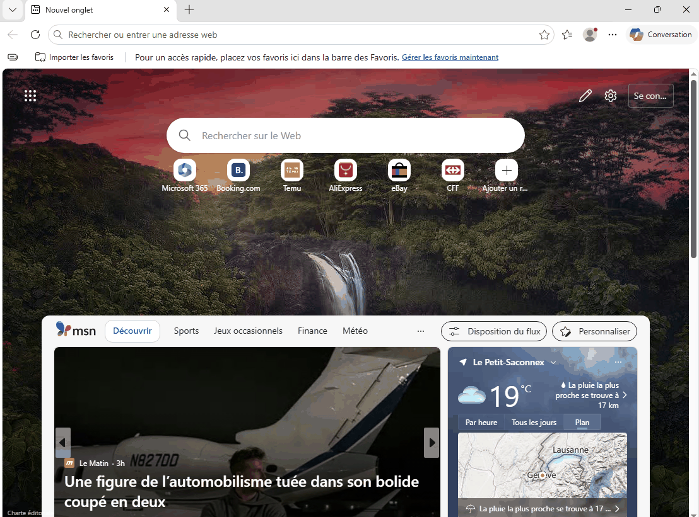
*Figure 35 — Le raccourci ouvre Edge normalement : le fichier sauvegardé est lisible.*

> [!WARNING]
> **Point de vigilance.** Avant de formater, la consigne demande de vérifier une dernière fois que la sauvegarde est lisible **depuis un autre poste**. Si la clé n'est lisible que sur le poste qui va être effacé, on ne découvrira le problème qu'une fois qu'il est trop tard.

# 5. Étape 4 — Réinstallation propre du système

## 5.1 Support d'installation : ISO monté à la place d'une clé bootable

La consigne prévoit un démarrage sur une clé USB bootable. Or l'image ISO de Windows 10 Pro 22H2 pèse **5,73 Go** et demande une clé d'au moins **8 Go**. Je ne disposais que de la clé de 4 Go, déjà utilisée pour la sauvegarde : il était donc impossible de créer une clé bootable, et surtout hors de question d'effacer la sauvegarde pour le faire.

J'ai donc choisi une solution équivalente, adaptée à une machine virtuelle : **monter directement le fichier ISO comme lecteur CD/DVD virtuel** dans les paramètres de la VM. La VM démarre sur l'ISO exactement comme un PC démarrerait sur une clé bootable.

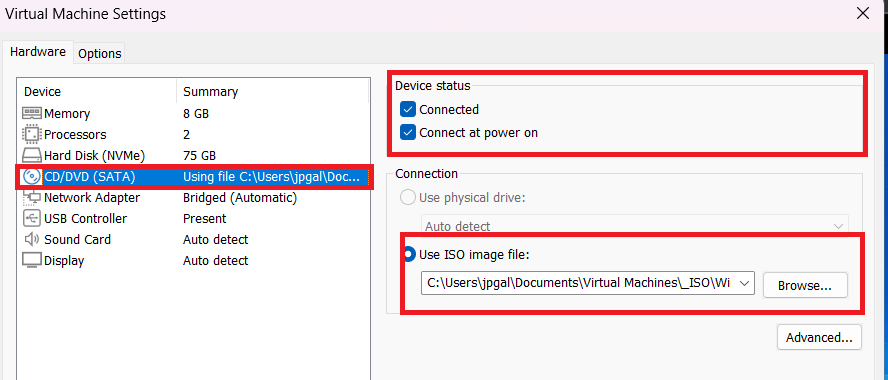
*Figure 36 — Paramètres de la VM : le lecteur CD/DVD (SATA) utilise le fichier ISO de Windows, connecté au démarrage.*

| Réglage | Valeur |
| --- | --- |
| Device status | Connected + Connect at power on (le lecteur est branché dès l'allumage) |
| Connection | Use ISO image file : `C:\Users\jpgal\Documents\Virtual Machines\_ISO\Win10_22H2_French_x64.iso` |

## 5.2 Effacement complet du disque

L'objectif de cette case est de repartir d'un disque **totalement vierge**. Sur une machine virtuelle, la méthode la plus simple et la plus fiable est de retirer l'ancien disque virtuel et d'en créer un nouveau : c'est l'équivalent de supprimer toutes les partitions puis de formater.

1. Éteindre la machine virtuelle (**Power Off**), puis ouvrir **VM → Settings**.

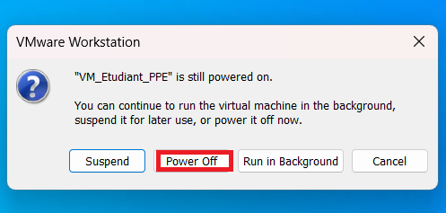
*Figure 37 — Extinction de la VM avant modification du matériel.*

2. Rester sur l'onglet **Hardware**.

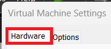
*Figure 38 — Onglet Hardware des paramètres de la VM.*

3. Sélectionner **Hard Disk (NVMe)** — 75 Go.

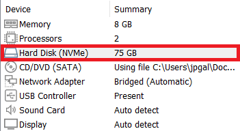
*Figure 39 — Sélection de l'ancien disque dur de 75 Go.*

4. Cliquer sur **Remove** pour retirer l'ancien disque, puis sur **Add** pour en ajouter un nouveau.

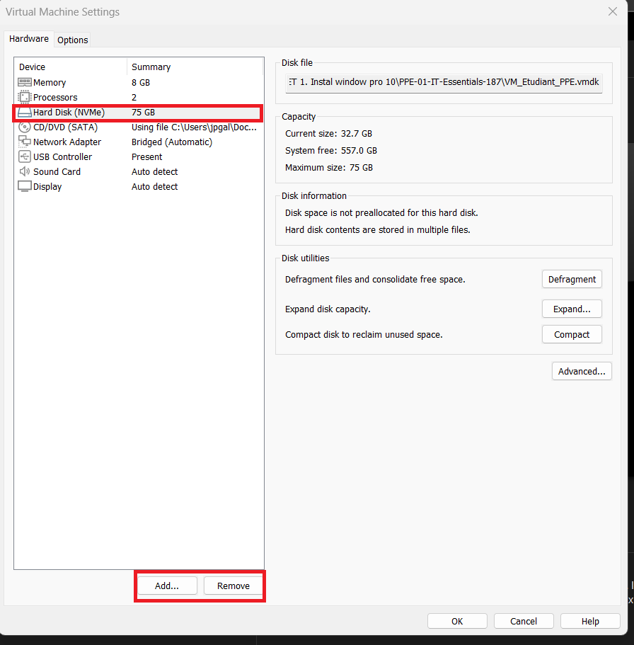
*Figure 40 — L'ancien disque contient 32,7 Go de données ; boutons Add et Remove.*

5. Choisir **Hard Disk**, puis **Next**.

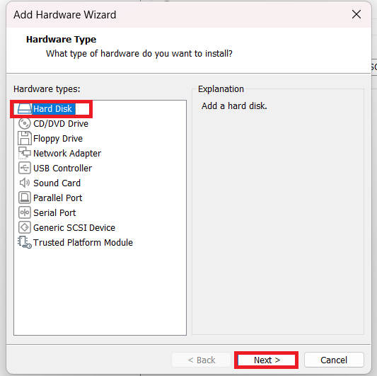
*Figure 41 — Assistant d'ajout de matériel : type Hard Disk.*

6. Garder le type **NVMe (Recommended)**, puis **Next**.

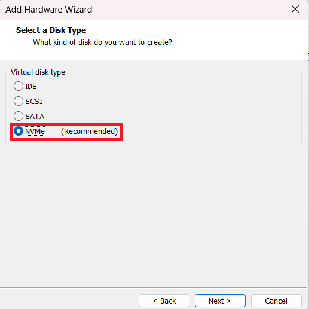
*Figure 42 — Type de disque virtuel NVMe.*

7. Sélectionner **Create a new virtual disk**, puis **Next**.

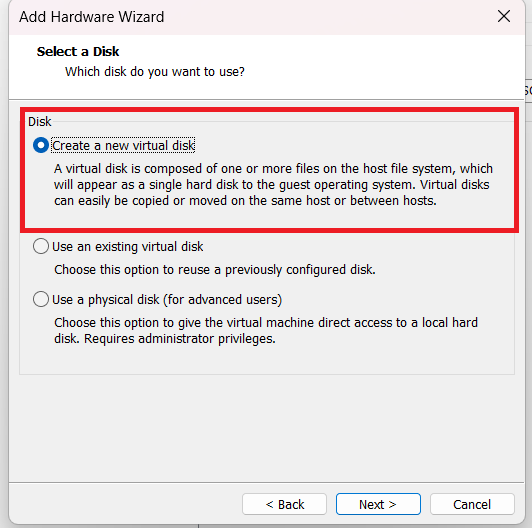
*Figure 43 — Création d'un nouveau disque virtuel.*

8. Indiquer une taille de **75 Go** (identique à l'ancien disque), laisser l'option « Split virtual disk into multiple files », puis **Next**.

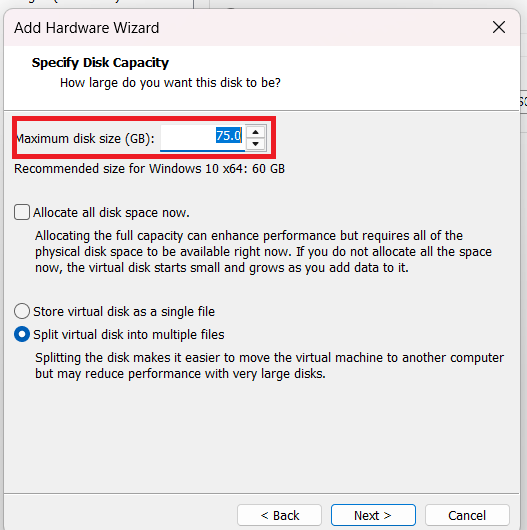
*Figure 44 — Taille du nouveau disque : 75 Go, découpé en plusieurs fichiers.*

9. Garder le nom proposé (`VM_Etudiant_PPE-0.vmdk`), puis **Finish**.

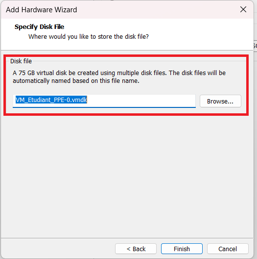
*Figure 45 — Nom du fichier du nouveau disque virtuel.*

10. Vérifier le résultat, puis valider avec **OK**.

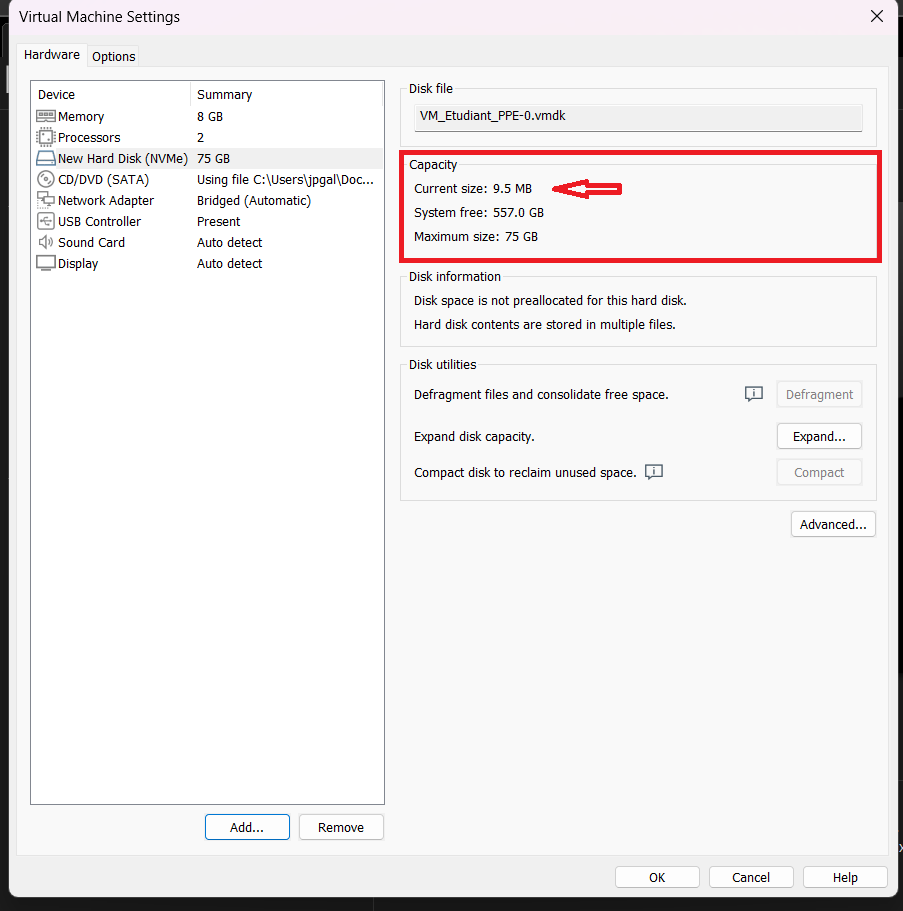
*Figure 46 — Le nouveau disque de 75 Go ne pèse que 9,5 Mo : il est bien vide. L'ISO est toujours monté.*

> [!NOTE]
> **Remarque.** Dans VMware, **Remove** détache le disque de la VM, mais le fichier .vmdk de l'ancien disque reste en général présent sur l'ordinateur hôte. Il faut le supprimer manuellement une fois la migration validée pour récupérer l'espace (et ne pas le faire avant : c'est une copie de secours supplémentaire).

## 5.3 Installation de Windows 10 Pro

Au démarrage, la VM ne trouve aucun système sur le disque vide et démarre sur l'ISO : l'installation de Windows commence.

1. Choisir la langue d'installation (Français - France), le format horaire et monétaire et le clavier (**Français - Suisse**), puis **Suivant**.

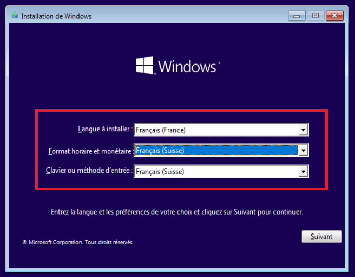
*Figure 47 — Choix de la langue, du format et du clavier.*

2. Cliquer sur **Installer maintenant**.

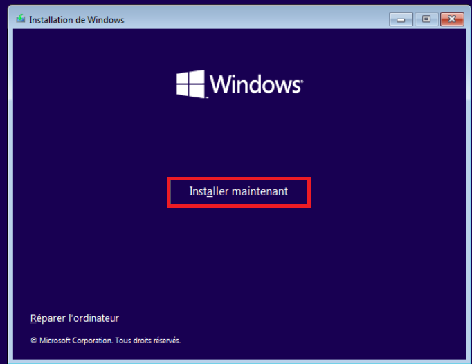
*Figure 48 — Lancement de l'installation.*

3. À la demande de clé de produit, cliquer sur **Je n'ai pas de clé de produit (Product Key)**.

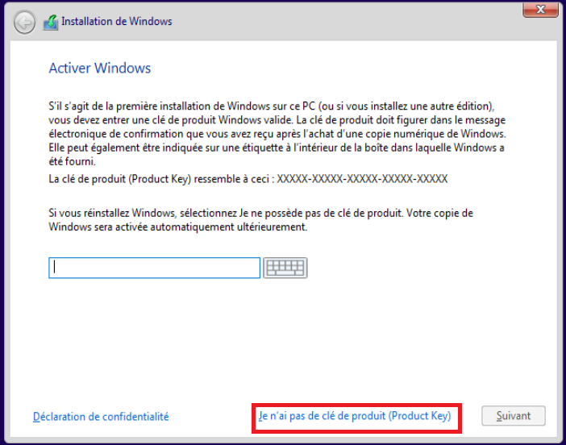
*Figure 49 — Installation sans clé de produit (aucune clé relevée à l'étape 1).*

4. Sélectionner **Windows 10 Professionnel**, puis **Suivant**.

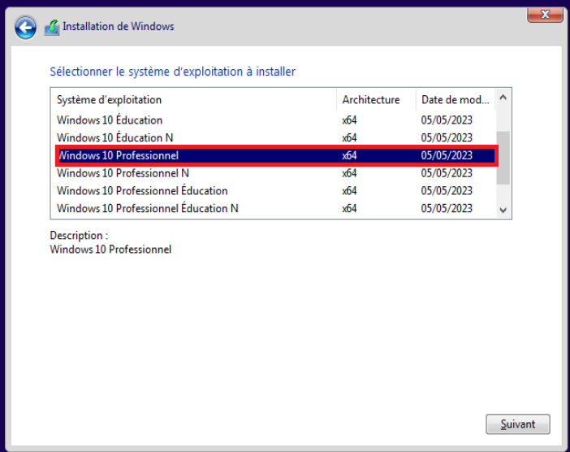
*Figure 50 — Choix de l'édition Windows 10 Professionnel x64.*

5. Cocher « J'accepte les termes du contrat de licence », puis **Suivant**.

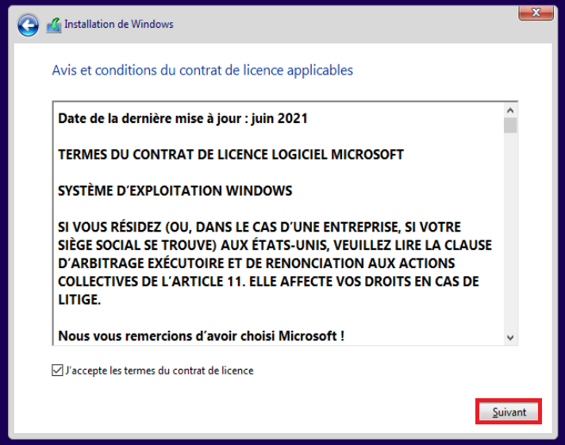
*Figure 51 — Acceptation du contrat de licence.*

6. Choisir **Personnalisé : installer uniquement Windows (avancé)**. L'option « Mise à niveau » conserverait l'ancien système, ce qui n'est pas le but d'une réinstallation propre.

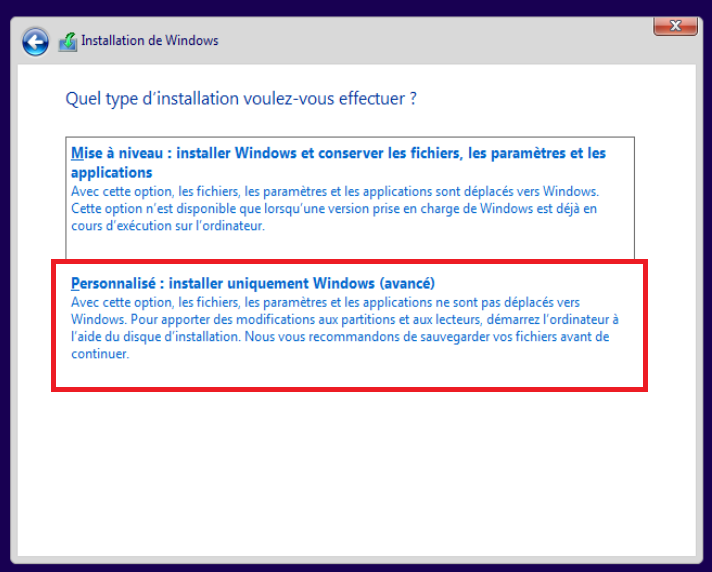
*Figure 52 — Type d'installation personnalisé.*

7. Sélectionner **Lecteur 0 Espace non alloué** (75 Go libres), puis **Suivant**.

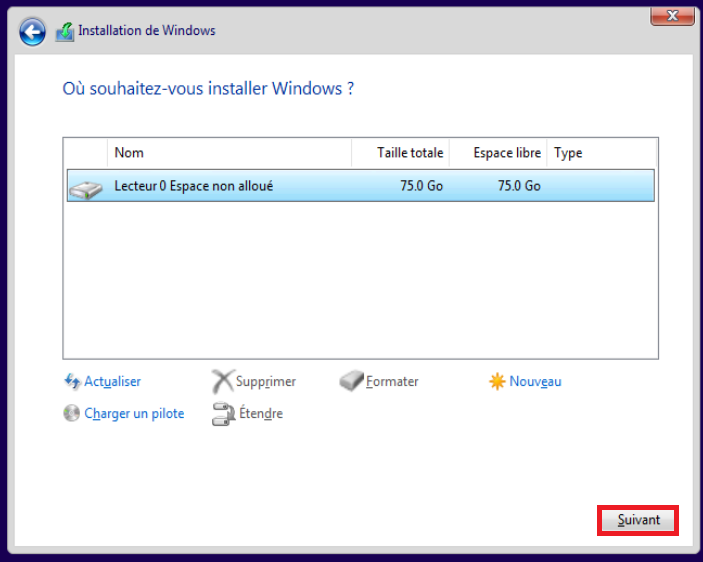
*Figure 53 — Le disque est entièrement non alloué : aucune ancienne partition ne subsiste.*

8. L'installation se lance : copie des fichiers, préparation, installation des fonctionnalités et des mises à jour.

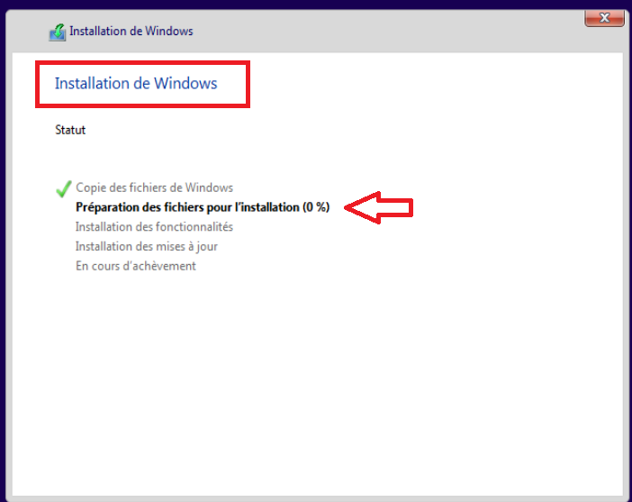
*Figure 54 — Installation de Windows en cours.*

9. Terminer la configuration initiale habituelle de Windows (région, clavier, compte local, confidentialité).

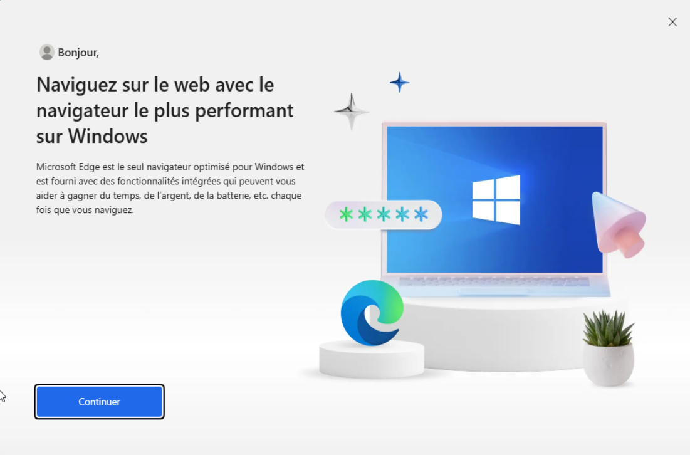
*Figure 55 — Premier démarrage terminé : écran d'accueil de Microsoft Edge sur le Windows neuf.*

## 5.4 Application de toutes les mises à jour

1. Ouvrir **Paramètres**, puis **Mise à jour et sécurité**.

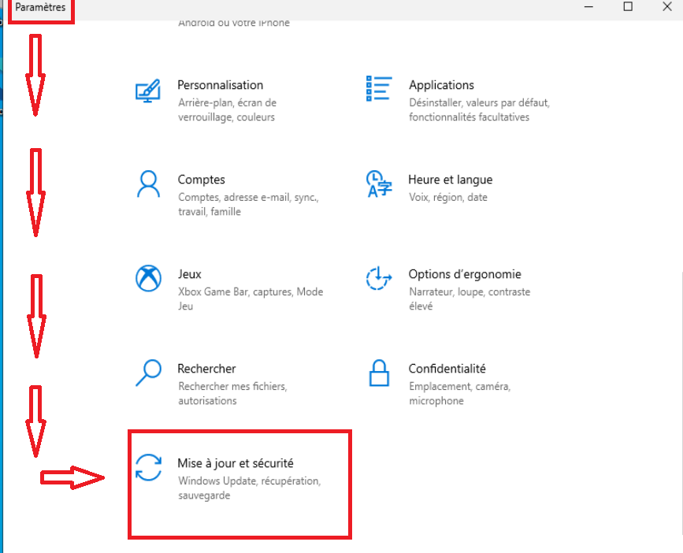
*Figure 56 — Paramètres Windows : rubrique « Mise à jour et sécurité ».*

2. Dans **Windows Update**, cliquer sur **Rechercher des mises à jour**.

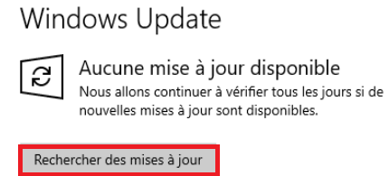
*Figure 57 — Bouton « Rechercher des mises à jour ».*

3. Laisser toutes les mises à jour se télécharger et s'installer, puis redémarrer autant de fois que demandé et relancer la recherche jusqu'à ce qu'il n'y en ait plus.

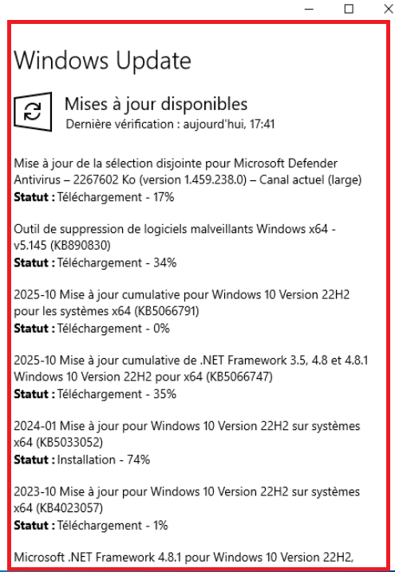
*Figure 58 — Téléchargement et installation des mises à jour (Defender, outil de suppression de logiciels malveillants, cumulatives 22H2, .NET Framework).*

## 5.5 Installation des pilotes manquants (VMware Tools)

Sur une machine virtuelle, les pilotes (carte graphique, réseau, souris, presse-papiers partagé…) sont fournis par le paquet **VMware Tools**. Il remplace ici l'installation des pilotes chipset, graphique et réseau d'un PC physique.

1. Dans VMware Workstation (et non dans la VM), ouvrir le menu **VM** puis cliquer sur **Install VMware Tools…**

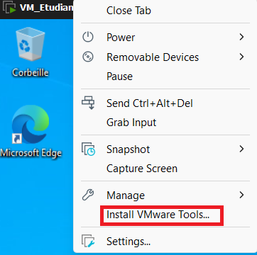
*Figure 59 — Menu VM de VMware Workstation : « Install VMware Tools… ».*

2. Dans la VM, un lecteur de DVD « VMware Tools » apparaît dans **Ce PC**. Si la fenêtre d'exécution automatique ne s'ouvre pas, ouvrir ce lecteur et lancer `setup64.exe`.

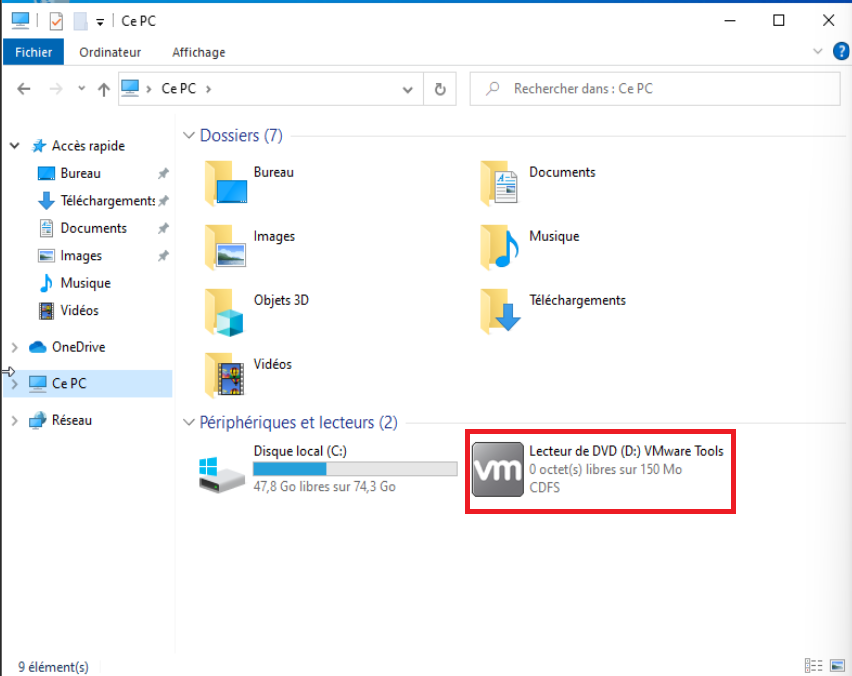
*Figure 60 — Lecteur de DVD virtuel VMware Tools monté dans la VM.*

3. Suivre l'assistant d'installation (installation typique).

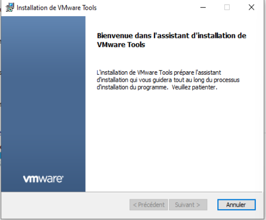
*Figure 61 — Assistant d'installation de VMware Tools.*

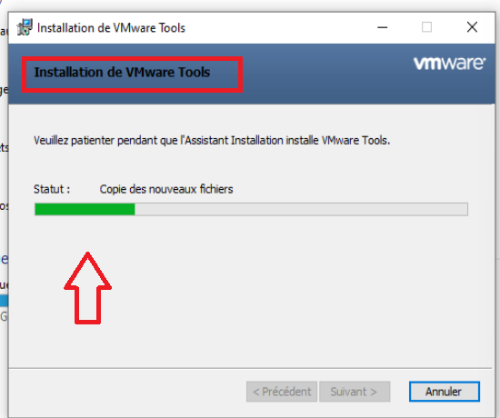
*Figure 62 — Copie des fichiers de VMware Tools.*

4. Accepter le redémarrage demandé à la fin de l'installation.


*Figure 63 — Redémarrage du poste pour finaliser l'installation des pilotes.*

# 6. Étape 5 — Réinstallation des logiciels

## 6.1 Réinstaller uniquement les logiciels identifiés

La démarche suivie est la suivante :

1. consulter la liste de référence sauvegardée (`logiciels.txt`, figure 24) ;

2. comparer avec ce qui est déjà présent sur le Windows neuf ;

3. identifier la différence : Microsoft Edge est déjà intégré à Windows 10, il ne manque que les **Microsoft Visual C++ Redistributable** ;

4. réinstaller uniquement ces composants.

Les Visual C++ Redistributable sont des bibliothèques dont beaucoup de programmes ont besoin pour fonctionner. Ils sont téléchargés depuis le **site officiel de Microsoft**, jamais depuis un site tiers :

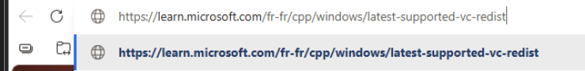
*Figure 64 — Page officielle de téléchargement : learn.microsoft.com/fr-fr/cpp/windows/latest-supported-vc-redist.*

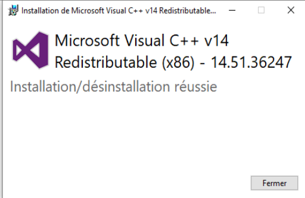
*Figure 65 — Installation réussie de Visual C++ v14 Redistributable (x86).*

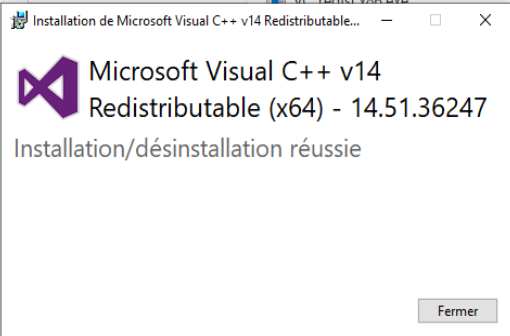
*Figure 66 — Installation réussie de Visual C++ v14 Redistributable (x64).*

La version installée (14.51.36247) est plus récente que celle d'origine (14.36.32532). Ce n'est pas un problème : les Visual C++ 2015 à 2022 sont rétrocompatibles, et installer la dernière version apporte les correctifs de sécurité.

## 6.2 Ressaisir les licences et clés produit

```powershell
slmgr /xpr
```

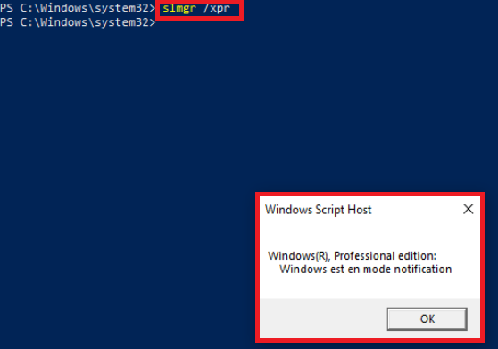
*Figure 67 — Après la réinstallation, Windows est toujours en mode notification.*

Ce résultat est cohérent avec l'inventaire de l'étape 1 : aucune clé OEM n'était présente dans le firmware et Windows n'était déjà pas activé. **Aucune clé produit n'était donc disponible à ressaisir.** Sur un vrai poste, c'est à cette étape qu'on saisit la clé relevée (Paramètres → Mise à jour et sécurité → Activation).

## 6.3 Vérifier que les logiciels sont bien installés

1. Ouvrir le **Panneau de configuration** depuis la barre de recherche.

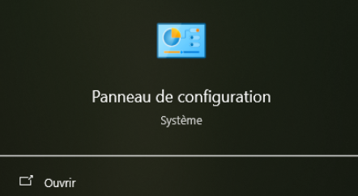
*Figure 68 — Recherche du Panneau de configuration.*

2. Cliquer sur **Programmes**.

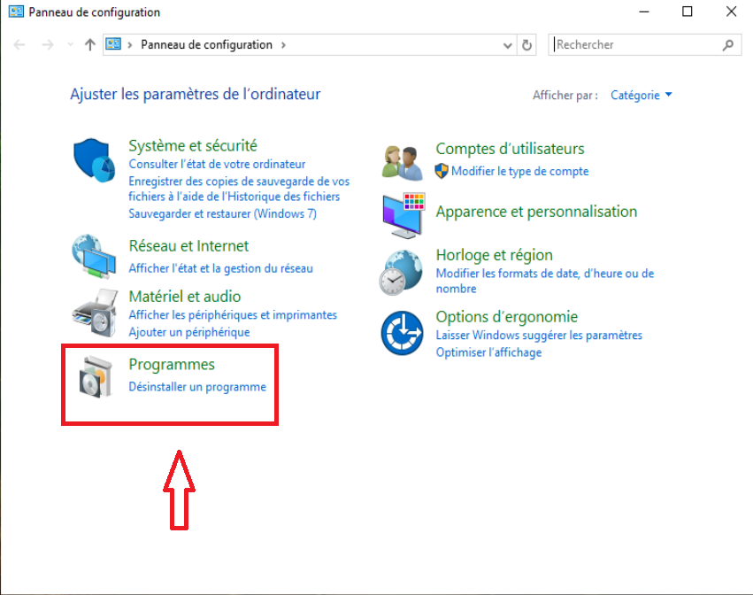
*Figure 69 — Panneau de configuration : rubrique Programmes.*

3. Cliquer sur **Programmes et fonctionnalités**.

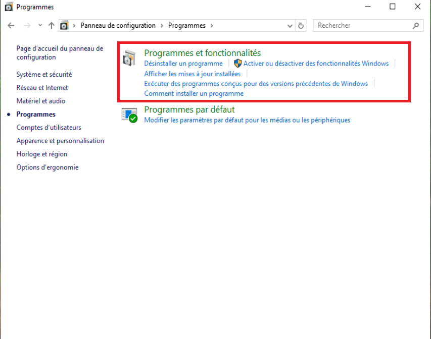
*Figure 70 — Rubrique « Programmes et fonctionnalités ».*

4. Vérifier la présence des logiciels dans la liste.

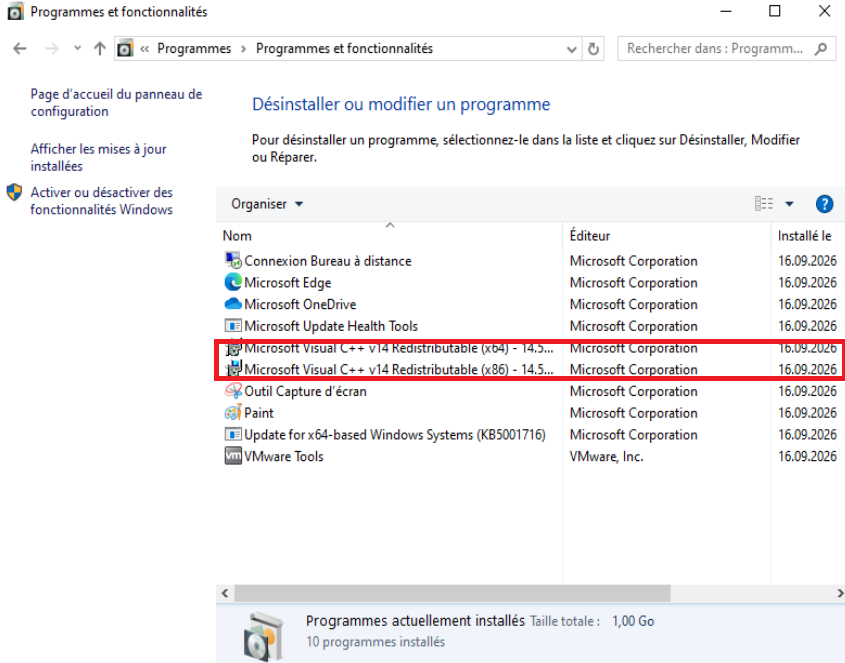
*Figure 71 — Liste des programmes installés : les deux Visual C++ v14 (x64 et x86) sont présents.*

| Logiciel | Présent | Remarque |
| --- | --- | --- |
| Microsoft Visual C++ v14 Redistributable (x64) | Oui ✔ | Installé le 16.09.2026 |
| Microsoft Visual C++ v14 Redistributable (x86) | Oui ✔ | Installé le 16.09.2026 |
| Microsoft Edge | Oui ✔ | Intégré à Windows, s'ouvre normalement |
| VMware Tools | Oui ✔ | Confirme l'installation des pilotes (section 5.5) |

> [!NOTE]
> **Remarque.** Les Visual C++ Redistributable ne sont pas des programmes qu'on « lance » : ce sont des bibliothèques utilisées par d'autres logiciels. Leur présence dans la liste suffit à confirmer leur bonne installation.

# 7. Étape 6 — Restauration des données et vérification

## 7.1 Recopie des données vers les dossiers d'origine

Les données sauvegardées sur la clé à l'étape 2 sont recopiées dans les dossiers personnels du poste réinstallé. C'est la commande de l'étape 2 avec la source et la destination inversées :

```powershell
Copy-Item "E:\Sauvegarde_2026-09-16\Documents\*"       -Destination "$env:USERPROFILE\Documents" -Recurse -Force
Copy-Item "E:\Sauvegarde_2026-09-16\Bureau\*"          -Destination "$env:USERPROFILE\Desktop"   -Recurse -Force
Copy-Item "E:\Sauvegarde_2026-09-16\Images\*"          -Destination "$env:USERPROFILE\Pictures"  -Recurse -Force
Copy-Item "E:\Sauvegarde_2026-09-16\Telechargements\*" -Destination "$env:USERPROFILE\Downloads" -Recurse -Force
```

L'option `-Force` écrase les fichiers du même nom déjà présents (par exemple le `desktop.ini` recréé par Windows). La vérification utilise `dir -Force`, qui affiche aussi les fichiers cachés :

```powershell
dir -Force "$env:USERPROFILE\Documents"
dir -Force "$env:USERPROFILE\Desktop"
dir -Force "$env:USERPROFILE\Pictures"
dir -Force "$env:USERPROFILE\Downloads"
```

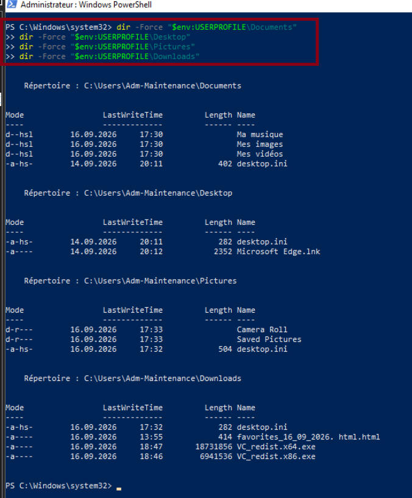
*Figure 72 — Contenu des dossiers personnels après restauration.*

| Dossier | Contenu restauré |
| --- | --- |
| Bureau | Microsoft Edge.lnk (2 352 octets) + desktop.ini (282 octets) — identique à la sauvegarde (figures 29 et 33) |
| Images | Camera Roll et Saved Pictures — identique à l'inventaire (figure 1) |
| Téléchargements | Fichier de favoris exporté + installateurs VC_redist.x64.exe et VC_redist.x86.exe |
| Documents | Dossiers systèmes « Ma musique », « Mes images », « Mes vidéos » et desktop.ini |

## 7.2 Réimportation des favoris dans le navigateur

1. Dans Edge, ouvrir **Paramètres → Profils → Importer les données du navigateur**.

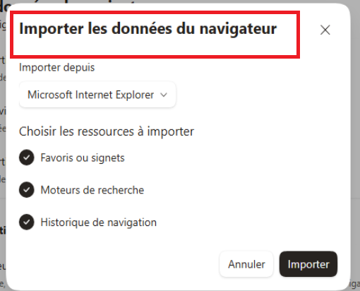
*Figure 73 — Fenêtre « Importer les données du navigateur ».*

2. Dans la liste « Importer depuis », choisir **Fichier HTML Favoris ou signets**.

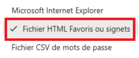
*Figure 74 — Source d'importation : fichier HTML de favoris.*

3. Aller sur la clé USB, dans `Sauvegarde_2026-09-16\Telechargements`, et sélectionner le fichier `favorites_16_09_2026. html`.

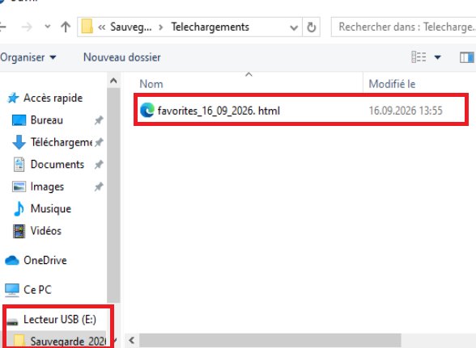
*Figure 75 — Sélection du fichier de favoris sur la clé USB.*

4. Lancer l'importation : Edge confirme que les données ont été importées.

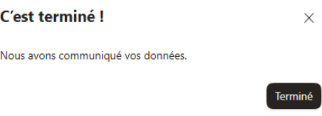
*Figure 76 — Importation des favoris terminée.*

## 7.3 Comparaison et validation par l'utilisateur

| Contrôle | Sauvegarde | Poste restauré | Résultat |
| --- | --- | --- | --- |
| Bureau : nombre de fichiers | 2 | 2 | Identique ✔ |
| Bureau : taille réelle | 2 634 octets | 2 352 + 282 = 2 634 octets | Identique ✔ |
| Images : dossiers | Camera Roll, Saved Pictures | Camera Roll, Saved Pictures | Identique ✔ |
| Favoris | Fichier HTML exporté | Importés dans Edge | Restaurés ✔ |
| Logiciels | logiciels.txt | Visual C++ x86/x64, Edge | Réinstallés ✔ |

La vérification finale confirme que l'ensemble des données identifiées à l'étape 1 est présent et accessible sur le poste restauré : dossiers personnels restaurés à l'identique de la sauvegarde, favoris réimportés, logiciels nécessaires réinstallés et fonctionnels. **Aucune donnée manquante n'a été constatée.**

> [!WARNING]
> **Point de vigilance.** Garder la clé de sauvegarde **intacte** jusqu'à la validation finale par l'utilisateur. Dans mon cas, la clé a pu être manipulée par une autre personne entre deux séances : son contenu a donc dû être revérifié avant la restauration. C'est exactement le genre de risque qui justifie de ne pas réutiliser le support de sauvegarde trop tôt.

# 8. Étape 7 — Reconfiguration des paramètres essentiels

## 8.1 Réseau

```powershell
ipconfig /all
```

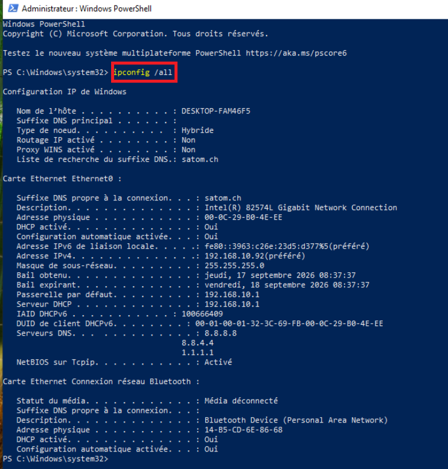
*Figure 77 — Configuration IP du poste après la réinstallation.*

Pour le domaine ou le groupe de travail, la commande suivante est plus directe :

```powershell
(Get-WmiObject Win32_ComputerSystem).Domain
(Get-WmiObject Win32_ComputerSystem).Workgroup
```

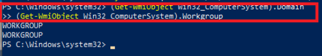
*Figure 78 — Le poste fait partie du groupe de travail WORKGROUP.*

| Paramètre | Avant (étape 1) | Après réinstallation |
| --- | --- | --- |
| Nom d'hôte | DESKTOP-B77F9D7 | DESKTOP-FAM46F5 |
| DHCP | Activé | Activé ✔ |
| Adresse IPv4 | 192.168.132.145 | 192.168.10.92 |
| Masque | 255.255.255.0 | 255.255.255.0 ✔ |
| Passerelle | 192.168.132.2 | 192.168.10.1 |
| DNS | 192.168.132.2 | 8.8.8.8, 8.8.4.4, 1.1.1.1 |
| Adresse physique | 00-0C-29-B0-4E-EE | 00-0C-29-B0-4E-EE ✔ |
| Groupe de travail | — | WORKGROUP |

L'adresse physique est identique : c'est bien la même carte réseau virtuelle. L'adresse IP, la passerelle et les DNS ont changé parce que la carte réseau de la VM est désormais en mode **Bridged** (figure 36) au lieu de NAT : la VM reçoit son adresse directement du serveur DHCP du réseau réel. Comme le poste est en DHCP, **aucune saisie manuelle n'est nécessaire** : le réseau fonctionne automatiquement.

> [!NOTE]
> **Remarque.** Windows a généré un nouveau nom d'hôte aléatoire. Sur un vrai poste, il faudrait le renommer comme l'ancien (`Rename-Computer -NewName "NOM"`) pour que les utilisateurs et les partages le retrouvent.

## 8.2 Imprimante : installation et test d'impression

```powershell
Get-Printer
```

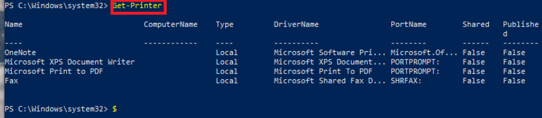
*Figure 79 — Imprimantes disponibles après la réinstallation.*

Aucune imprimante physique n'existait avant la migration. Le test d'impression est donc réalisé avec l'imprimante virtuelle **Microsoft Print to PDF** :

1. Ouvrir le Bloc-notes, écrire un texte de test (« test d'impression -PPE3 »), puis **Fichier → Imprimer**.

2. Sélectionner **Microsoft Print to PDF**, puis **Imprimer**.

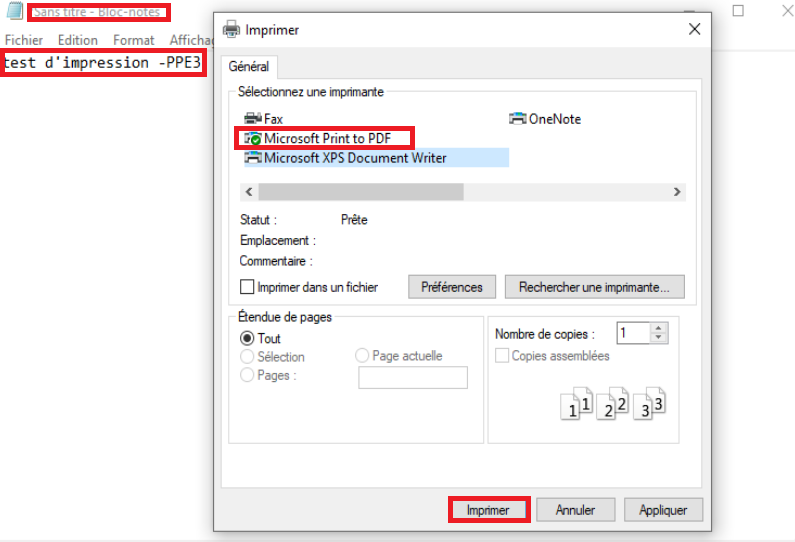
*Figure 80 — Impression du texte de test vers Microsoft Print to PDF.*

3. Enregistrer le fichier PDF sur le Bureau sous le nom `test_impression_PPE3`.

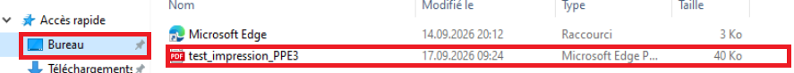
*Figure 81 — Le fichier test_impression_PPE3.pdf apparaît sur le Bureau.*

4. Ouvrir le PDF pour vérifier son contenu.

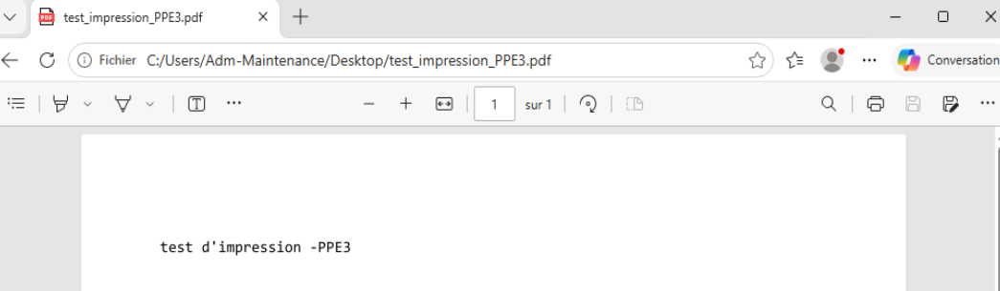
*Figure 82 — Le PDF s'ouvre et contient bien le texte de test : l'impression fonctionne.*

## 8.3 Comptes utilisateurs : création, droits et mot de passe

La procédure est détaillée pour le compte de **David Rey**, puis appliquée à l'identique pour **Abi Kanthavel** et **Ardit Katana**.

```powershell
New-LocalUser -Name "David.Rey" -Password (ConvertTo-SecureString "<mot_de_passe>" -AsPlainText -Force) `
  -FullName "David Rey" -Description "Compte étudiant"
```

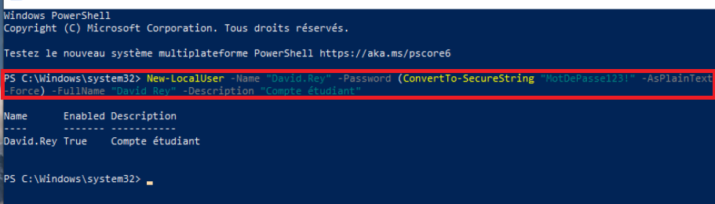
*Figure 83 — Création du compte David.Rey.*

| Élément | Rôle |
| --- | --- |
| `New-LocalUser -Name` | Crée un compte local ; le nom indiqué sert à la connexion. |
| `ConvertTo-SecureString … -AsPlainText -Force` | Transforme le mot de passe tapé en texte en chaîne sécurisée, format exigé par `-Password`. |
| `-FullName` | Nom complet affiché sur l'écran de connexion. |
| `-Description` | Rappelle la fonction du compte (« Compte étudiant »). |

Le compte est ensuite ajouté au groupe **Utilisateurs** (droits standards, sans administration), puis sa création est vérifiée :

```powershell
Add-LocalGroupMember -Group "Utilisateurs" -Member "David.Rey"
Get-LocalUser -Name "David.Rey"
```

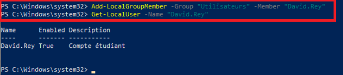
*Figure 84 — Ajout au groupe Utilisateurs et vérification : le compte est actif (Enabled = True).*

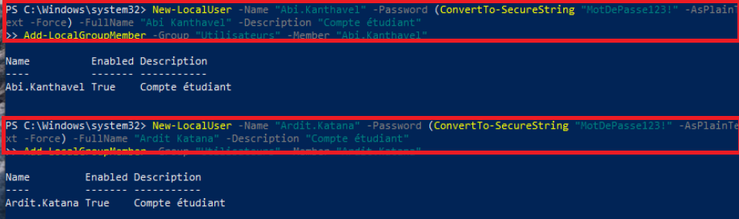
*Figure 85 — Même procédure pour les comptes Abi.Kanthavel et Ardit.Katana.*

> [!WARNING]
> **Remarque de sécurité.** Avec `-AsPlainText`, le mot de passe apparaît en clair à l'écran et reste dans l'historique de PowerShell. Sur un vrai poste, il vaut mieux utiliser `Read-Host -AsSecureString`, comme dans le Projet 2, et cocher « L'utilisateur doit changer le mot de passe à la prochaine ouverture de session ».

> [!WARNING]
> **Point de vigilance.** Les noms de connexion sont maintenant écrits avec un point (`David.Rey`) alors qu'ils contenaient un espace sur l'ancien poste (`David Rey`). Les profils seront donc créés dans `C:\Users\David.Rey`. Il faudra aussi réappliquer les permissions NTFS et les stratégies de sécurité du Projet 2, qui ont été perdues avec la réinstallation.

## 8.4 Comptes mail, VPN, partages réseau et sauvegarde automatique

Conformément à l'inventaire de l'étape 1, **aucun compte mail local (Outlook), aucun profil VPN et aucun partage réseau** n'étaient configurés sur le poste avant la réinstallation. Ces éléments n'ont donc pas nécessité de reconfiguration.

Aucune sauvegarde automatique n'était en place sur le poste d'origine. Il est recommandé d'en mettre une en place pour éviter une perte de données lors d'une future panne ou réinstallation, par exemple avec l'**Historique des fichiers** de Windows vers un disque externe, ou une **tâche planifiée** lançant `robocopy` chaque semaine.

# 9. Étape 8 — Procédure de migration réutilisable

Cette procédure résume la migration sous forme de liste à suivre sur n'importe quel poste Windows. Les sections indiquées renvoient au détail et aux captures de ce rapport.

## 9.1 Procédure numérotée

| N° | Action | Commande ou emplacement | Détail |
| --- | --- | --- | --- |
| 1 | Lister les dossiers personnels | `dir "$env:USERPROFILE\<dossier>"` | 2.1 |
| 2 | Localiser le profil du navigateur | `%LOCALAPPDATA%\Microsoft\Edge\User Data\Default` | 2.2 |
| 3 | Relever la configuration réseau (sur papier aussi) | `ipconfig /all` | 2.3 |
| 4 | Lister les logiciels | `winget list` ou registre Uninstall | 2.4 / 3.5 |
| 5 | Contrôler mails, clé produit, activation, VPN, certificats | `Get-VpnConnection`, `slmgr /xpr`, `Cert:\` | 2.5 |
| 6 | Relever comptes et imprimantes | `Get-LocalUser`, `Get-Printer` | 2.6 |
| 7 | Capturer l'espace utilisé du disque | Ce PC → C: → Propriétés | 3.1 |
| 8 | Vérifier l'espace du support de sauvegarde | `Measure-Object -Sum` | 3.2 |
| 9 | Créer une arborescence datée et copier les données | `New-Item`, `Copy-Item -Recurse` | 3.3 |
| 10 | Exporter les favoris en HTML dans Config | Edge → Favoris → Exporter | 3.4 |
| 11 | Exporter logiciels et réseau en .txt | `> fichier.txt` | 3.5 |
| 12 | Comparer source et sauvegarde, ouvrir des fichiers | Propriétés des dossiers | 4 |
| 13 | Vérifier la sauvegarde depuis un autre poste | — | 4.4 |
| 14 | Démarrer sur le support d'installation et effacer le disque | Clé bootable ou ISO monté | 5.1 / 5.2 |
| 15 | Installer Windows (installation personnalisée) | Assistant d'installation | 5.3 |
| 16 | Installer toutes les mises à jour | Windows Update | 5.4 |
| 17 | Installer les pilotes | VMware Tools ou site du constructeur | 5.5 |
| 18 | Réinstaller les logiciels de la liste et les licences | Sites officiels, `slmgr` | 6 |
| 19 | Restaurer les données et les favoris | `Copy-Item -Force`, Edge → Importer | 7 |
| 20 | Reconfigurer réseau, imprimante et comptes | `ipconfig`, `Get-Printer`, `New-LocalUser` | 8 |
| 21 | Faire valider par l'utilisateur, puis libérer la sauvegarde | — | 7.3 |

## 9.2 Points de vigilance et pièges rencontrés

| Piège ou risque | Conséquence | Bonne pratique |
| --- | --- | --- |
| Oublier `env:` dans `$env:USERPROFILE` | Chemin faux (C:\Pictures), erreur rouge | Relire la commande, utiliser la touche Tab pour compléter |
| Formater sans avoir vérifié la sauvegarde | Perte définitive des données | Comparer fichiers et tailles, tester depuis un autre poste |
| `-ErrorAction SilentlyContinue` lors de la copie | Erreurs de copie invisibles | Toujours contrôler le résultat après la copie |
| Fichier `winget list > fichier.txt` presque vide | Liste des logiciels inutilisable | Ouvrir le fichier pour vérifier ; utiliser le registre si besoin |
| Favoris enregistrés dans le mauvais dossier, espace avant l'extension | Fichier difficile à retrouver, double extension | Vérifier le dossier et le nom avant d'enregistrer |
| Clé USB trop petite pour être bootable (4 Go < 8 Go) | Impossible de créer le support d'installation | Prévoir une clé de 8 Go minimum, distincte de la sauvegarde |
| Captures d'écran prises trop tard | Preuves irrécupérables après le formatage | Faire les captures « avant » dès l'étape 2 |
| Support de sauvegarde manipulé par quelqu'un d'autre | Sauvegarde effacée ou modifiée | Étiqueter la clé et la garder jusqu'à la validation |
| Mot de passe en clair dans une commande | Mot de passe visible et historisé | `Read-Host -AsSecureString` |
| Nom d'hôte, noms de comptes et droits NTFS différents | Partages et scripts qui ne trouvent plus le poste ou les profils | Recréer à l'identique ce qui a été relevé à l'étape 1 |

# 10. Conclusion

La migration du poste a été réalisée **sans perte de données**. L'inventaire a permis d'identifier tout ce qui devait être conservé, la sauvegarde a été vérifiée avant l'effacement du disque, et Windows 10 Pro a été réinstallé proprement sur un disque vierge, mis à jour et équipé de ses pilotes. Les données personnelles, les favoris et les logiciels nécessaires ont été restaurés, puis le réseau, l'impression et les comptes utilisateurs ont été reconfigurés et testés.

La principale contrainte a été l'absence d'une clé USB de 8 Go pour créer un support bootable. Elle a été contournée en montant directement l'ISO dans VMware, ce qui reproduit le même comportement dans un environnement virtualisé, sans risquer la clé de sauvegarde.

**Ce que j'ai appris.** La leçon la plus importante est l'ordre des opérations : on ne formate jamais avant d'avoir **vérifié** la sauvegarde, car une copie « sans erreur affichée » n'est pas forcément une copie complète. J'ai aussi appris à rediriger le résultat d'une commande dans un fichier texte, à retrouver des données moins visibles (profil du navigateur, certificats, VPN, clé produit) et à comparer une source et une copie avec la taille réelle plutôt que la taille sur le disque.

**Améliorations possibles.**

- Automatiser la sauvegarde et la restauration dans un script PowerShell complet, en ajoutant les dossiers Vidéos et Musique et les profils des trois élèves.
- Remplacer la comparaison manuelle par une vérification automatique pour tous les dossiers (nombre de fichiers et taille totale avec `Measure-Object`), ou utiliser `robocopy /E /LOG`, qui produit un rapport de copie.
- Réappliquer les permissions NTFS, le verrouillage de session et les stratégies de mots de passe du Projet 2.
- Renommer le poste avec son ancien nom d'hôte et activer Windows avec une licence valide.
- Mettre en place une sauvegarde automatique (Historique des fichiers ou tâche planifiée).
- Prendre un instantané (snapshot) de la VM avant l'effacement du disque, comme filet de sécurité supplémentaire.

# Annexe — Récapitulatif des commandes utilisées

| Commande | Rôle | Étape |
| --- | --- | --- |
| `dir "$env:USERPROFILE\…"` | Afficher le contenu d'un dossier personnel | 1, 6 |
| `ipconfig /all` | Afficher la configuration réseau complète | 1, 7 |
| `winget list` | Lister les logiciels installés | 1, 2 |
| `Get-ItemProperty HKLM:\…\Uninstall\*` | Lister les programmes depuis le registre | 2 |
| `(Get-WmiObject …).OA3xOriginalProductKey` | Lire la clé produit OEM du firmware | 1 |
| `slmgr /xpr` | Afficher l'état d'activation de Windows | 1, 5 |
| `Get-VpnConnection` | Lister les connexions VPN | 1 |
| `Get-ChildItem -Path Cert:\…\My` | Lister les certificats personnels | 1 |
| `Get-LocalUser` | Lister les comptes locaux | 1, 7 |
| `Get-Printer` | Lister les imprimantes | 1, 7 |
| `Measure-Object -Property Length -Sum` | Calculer la taille totale de fichiers | 2 |
| `New-Item -ItemType Directory` | Créer un dossier | 2 |
| `Copy-Item -Recurse` | Copier des dossiers et leur contenu | 2, 6 |
| `commande > fichier.txt` | Enregistrer le résultat d'une commande dans un fichier | 2 |
| `(Get-WmiObject Win32_ComputerSystem).Workgroup` | Afficher le groupe de travail | 7 |
| `New-LocalUser` | Créer un compte local | 7 |
| `Add-LocalGroupMember` | Ajouter un compte à un groupe local | 7 |
